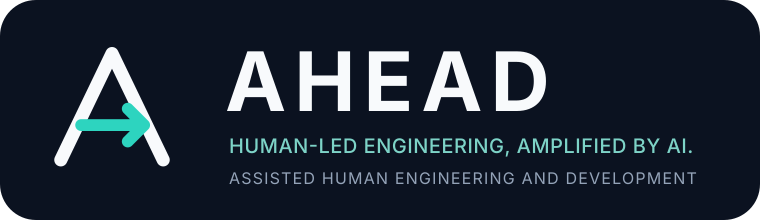

<p align="center">
  
</p>

# AHEAD

**Assisted Human Engineering and Development**

> Human-led engineering, amplified by AI.

AHEAD is a methodology for using AI in software engineering without transferring understanding, judgment, or accountability away from humans.

Its core loop is:

> Human thinks first → AI amplifies and challenges → Human decides.

AHEAD is being designed for several kinds of engineering work, including features, bugs, operational issues, incidents, refactoring, architecture decisions, technical debt, security issues, and investigations. These work types share principles, but they do not have to share one rigid workflow.

## Use AHEAD

- [Practitioner guide](docs/guide/README.md) is the starting point for applying the framework.
- [Constitution](CONSTITUTION.md) records AHEAD's non-negotiable principles.
- [Pilot workflows](docs/guide/workflows/README.md) provide the six diagrammed flows.
- [AHEAD for Pi](integrations/pi/README.md) installs and operates the first dogfood integration.
- [AHEAD for VS Code](integrations/vscode/README.md) provides the editor workflow UI and Copilot integration.

## Evidence and provenance

- [Evidence library](docs/evidence/README.md) separates empirical evidence, standards, established practice, design hypotheses, and submitted source notes.

## Develop AHEAD

- [Development guide](docs/development/README.md) is the starting point for changing the methodology, workflow engine, generated policy, integrations, or publishing path.

The Constitution and practitioner guide are packaged as Pi framework references. Evidence is available on demand. AHEAD-owned research, ticket-decomposition, and debugging skills are bundled for progressive disclosure. Development documents remain repository-only and are not placed in ordinary practitioner or agent context.

## Status

AHEAD has six minimal workflow profiles encoded as executable workflow definitions: Product Change, Corrective Debugging, Operational Stabilization, Decision, Investigation, and Internal Improvement. The deterministic Rust core compiles to WebAssembly; the Pi integration lets a human select a flow, provides a persistent guided mode, injects a compact agent profile plus active-phase policy, enforces human/AI actor boundaries and tool capabilities, exposes human gates, packages the framework Markdown for workflow-aware human or AI reference, and supplies thin AHEAD-owned skills for research, ticket decomposition, and disciplined bug diagnosis.

The current priority is to dogfood all six flows and refine their shared state model and workflow-specific gates. GitHub/CI enforcement is not implemented yet.

Zed support is planned, but its current extension API cannot provide the dynamic tool controls, persistent workflow UI, and human gate/review integration needed for AHEAD parity. We will revisit it as those APIs mature.

No complete AHEAD workflow has yet been experimentally validated. The methodology distinguishes direct empirical support, adjacent evidence, standards, established practice, and AHEAD design hypotheses rather than presenting them as equally certain.

## What AHEAD is not

AHEAD is not:

```text
Prompt → AI designs → AI codes → human reviews AI output
```

It is:

```text
Human defines → AI researches → Human understands
→ AI expands and challenges → Human decides → Human plans
→ Engineer implements with AI assistance
→ AI reviews → Human reviews → Team learns
```
