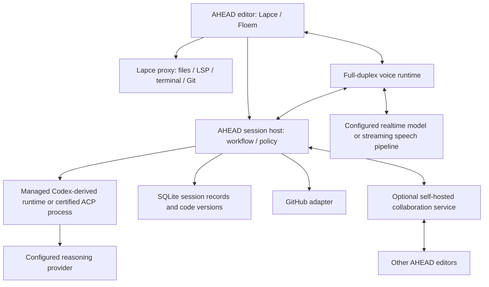

# AHEAD Editor: product and architecture proposal

Status: editor/repository direction confirmed by the user; architecture details remain a draft, not an implementation.
Prepared: 2026-09-17.
Audience: AHEAD maintainers.
Companion: [proposed DTOs](ahead-editor-contracts.ts).

## 1. Recommended direction

Build a native editor for engineers who want to remain responsible for the thinking and the code. A persistent **work session** connects the problem, human reasoning, selected code, conversations, bounded agent assistance, evidence, and review. A session can survive a sprint boundary or a change of engineer.

The differentiator should be the quality of working together: an agent can show the relevant code, listen while the engineer reasons aloud, ask a useful question, prepare repetitive work within a stated boundary, and retain the reasoning for the next person. Measure that experience before optimizing autonomous task throughput.

This repository becomes **AHEAD, the editor**, as a maintained fork of Lapce. Replace the existing framework, workflow engine, Pi/VS Code integrations, generated policy and release tooling; no legacy runtime or data compatibility is required. Carry forward the human-led engineering principles through native editor behavior. Derive a separately versioned agent runtime from Codex app-server and keep ACP as a second backend. Treat DeltaDB as a dependency requiring verification, with a concrete Yrs-based collaboration fallback. Lapce provides native plugins and LSP, not general VS Code extension compatibility.

Confirmed requirements: the first usable editor has **streamed, full-duplex voice**, including listening during speech playback and ongoing coding work. Predictions receive the active AHEAD work and mode, current unsaved code, relevant other open files and recent edits. These are foundation requirements, not later enhancements.

The user has selected the repository replacement, Lapce fork, full-duplex streaming voice and contextual predictions. Remaining policy and DTO choices below are AI-authored proposals, not accepted workflow gates. The open authority question is whether Assist must retain Maieutic's strict prohibition on agent-written business logic. This draft assumes it does; deleting the old implementation does not settle that policy question.

## 2. Principles retained; implementation replaced

| Principle | Native editor behavior |
|---|---|
| Human thinks first; AI amplifies and challenges; human decides | Capture the engineer's intent, distinguish suggestions from decisions, and keep effects under explicit human control |
| Work has an outcome and evidence | Work sessions connect issues, the current phase, code, reasoning, a plan and verification |
| Learning and assistance are different interactions | Learn and Assist control teaching behavior, tools and prediction policy |
| Explanations refer to real code | Resolve paths and versioned anchors before highlighting or pointing; preserve the human caret |
| Planning can stop before implementation | Durable checkpoints and tracker updates let another engineer resume later |
| Humans and agents retain their authorship | Attribute messages, proposals, accepted changes and review to authenticated participants |

The six work categories below are a starting product vocabulary, not an obligation to reproduce the old workflow specifications. Implement the necessary phase rules in the editor session host. There is no separate methodology product, ahead-core dependency, legacy run importer or old extension release to maintain.

Maieutic remains a source of interaction principles: [Learn/Assist overview](../../../vscode-maieutic/README.md), [focus model](../../../vscode-maieutic/src/model.ts), [Learn instructions](../../../vscode-maieutic/agents/socraites.agent.md), and [Assist instructions](../../../vscode-maieutic/agents/socraites-pair.agent.md). Extract the behavior needed for the editor; do not make the editor depend on the sibling VS Code integration.

The current checkout still contains the old implementation, eight pre-existing modified integration/test files and local run directories. This planning revision has not deleted them. Section 12 specifies the repository replacement and preservation of uncommitted work outside the shipping tree.

## 3. Decisions that materially affect feasibility

### 3.1 Lapce is the selected foundation

Lapce's current workspace separates app, core, proxy, and RPC crates and uses Floem. Its document and editor code already expose diagnostics, inline completions, selections, rope deltas, and rendering facilities. These are useful attachment points for AHEAD. This is source inspection, not a successful build or a performance/accessibility evaluation. [Lapce workspace](https://github.com/lapce/lapce/blob/master/Cargo.toml), [document model](https://github.com/lapce/lapce/blob/master/lapce-app/src/doc.rs), [editor](https://github.com/lapce/lapce/blob/master/lapce-app/src/editor.rs).

Pin an upstream commit for the fork and demonstrate:

1. A repeatable build and packaging path on the first supported OS.
2. Rust and TypeScript project navigation, diagnostics, search, editing, Git diff, and terminal.
3. A highlight and pointer overlay that does not disturb the user's caret, undo history, or IME.
4. A code-anchored conversation widget with keyboard and screen-reader access.
5. An external edit passing through the document model without dropping unsaved changes.
6. A two-client text-edit experiment, including undo, Unicode and reconnect.

Recommend macOS for the first daily-driver pilot because that is the present development environment. Keep Linux and Windows as named later validation targets; do not claim support merely because upstream runs there.

Upstream provides reusable editor improvements, but integrating them still requires conflict resolution and regression checks. Preserve upstream history, crate names and module boundaries; keep AHEAD changes concentrated at explicit extension points. Section 12 defines the update strategy.

### 3.2 VS Code extensions: an explicit compatibility gap

Lapce currently advertises a WASI plugin system and built-in LSP. A maintainer explicitly declined implementing VS Code extensions in the upstream discussion. Its proxy uses a WASM runtime, not the VS Code extension host. Sharing a language server or a theme does not mean running the original VS Code extension. [Current Lapce features](https://lap.dev/lapce/), [maintainer response](https://github.com/lapce/lapce/discussions/2688), [proxy dependencies](https://github.com/lapce/lapce/blob/master/lapce-proxy/Cargo.toml), [VS Code extension host](https://code.visualstudio.com/api/advanced-topics/extension-host).

The fork decision stands; “users can run VS Code extensions today” is not a valid inherited capability. If unmodified VS Code extensions become mandatory, a compatibility implementation would be additional AHEAD work and must be scoped before promising it. The MVP recommendation remains native Lapce plugins, reusable language servers and selected asset imports.

| Extension content | MVP position |
|---|---|
| Standalone language server | Support through Lapce's LSP integration; validate packaging, settings and server license |
| Diagnostics such as Error Lens | Render inline from existing diagnostics; verify current native support before adding code |
| Color themes and snippet data | Import a documented subset, with a compatibility report |
| TextMate grammars | Translate/evaluate separately; do not assume Lapce's parser consumes them |
| Node-based VS Code extension using editor APIs | Unsupported unless individually ported |
| Webviews, notebooks, custom editors, debug/test adapters | Separate later projects with explicit API coverage |
| AI extensions that bypass AHEAD policy | Not supported as managed AHEAD assistants |

A VSIX is packaging, not a compatibility layer. Do not build a general VS Code API shim for the MVP. Use licensed publisher downloads, an approved registry such as Open VSX after checking availability, and native Lapce plugins. Microsoft's FAQ explicitly excludes alternative products from accessing its Marketplace; source licenses and extension distribution rights must be checked independently. [Marketplace restrictions](https://code.visualstudio.com/docs/supporting/faq#i-cant-access-the-visual-studio-marketplace-from-product--fill-in-the-blank--why-not).

### 3.3 Own the policy boundary; reuse the agent machinery

Codex app-server is intended for rich product integrations and exposes conversations, streamed turns, approvals, and lifecycle control. Start with its local stdio boundary and generated schema. Pin the runtime revision and protocol; do not couple the editor to unversioned internal Rust structures. [Codex app-server](https://learn.chatgpt.com/docs/app-server).

Use a maintained AHEAD runtime fork only where the managed policy cannot be enforced through supported configuration and host tools. Candidate patches:

- Replace autonomous engineering instructions with the selected AHEAD phase and Learn/Assist profile.
- Restrict the registered tool set; remove direct mutation and arbitrary command paths from managed sessions.
- Route reads of open documents, presentation, proposed edits, and approved application through AHEAD.
- Audit disabled paths such as shell, nested execution, hooks, plugins, subagents, and MCP mutations.
- Add only provider transports missing from the pinned runtime and actually needed by the pilot.

Keep upstream inference streaming, conversation management, cancellation, context handling, and security maintenance where compatible. Do not copy a few loop functions and assume the surrounding runtime can be discarded. Use a separate process so a runtime crash does not take down the editor.

Codex's current official configuration documents already include local Ollama/LM Studio, custom providers, Azure, and a built-in Amazon Bedrock provider with AWS profile/region support. Reuse these before designing a new provider stack. This does not establish that every model on each service supports every feature. [Provider configuration](https://learn.chatgpt.com/docs/config-file/config-advanced).

Both Lapce and the public Codex repository are Apache-2.0 licensed. Preserve license/NOTICE material, attribution, and notices of modifications; check bundled dependencies separately. That license does not grant access to hosted services or brand rights. The public Codex repository is not a blanket license to copy every feature of the desktop product. Retain applicable MIT notices for any Maieutic/AHEAD material actually carried into the editor. [Codex license](https://github.com/openai/codex/blob/main/LICENSE), [Lapce license](https://github.com/lapce/lapce/blob/master/LICENSE).

### 3.4 ACP is a backend option, not a competing product architecture

AHEAD owns sessions, modes, code anchors, human gates and presentation regardless of agent. Initially ship one managed runtime and one tested ACP backend. Use ACP's initialization, prompting, cancellation, updates, permissions and filesystem support where available; AHEAD-specific presentation can be an optional tool surface.

ACP filesystem requests can access unsaved client text. Its advertised capabilities tell an agent which client methods it may use; they do not sandbox an agent's direct operating-system access. A mode label is not proof of enforcement. [ACP overview](https://agentclientprotocol.com/protocol/v1/overview), [filesystem methods](https://agentclientprotocol.com/protocol/v1/file-system), [session modes](https://agentclientprotocol.com/protocol/v1/session-modes).

Managed Assist requires tested mediation and sandboxing. An arbitrary external ACP process may be offered as an explicitly external integration later, but cannot claim AHEAD's enforcement guarantees. Switching backends creates a new backend conversation with an explicit evidence/handoff package; raw hidden state and provider-specific tool history are not assumed portable.

### 3.5 DeltaDB is desirable; availability remains a gate

Delta's August announcement describes synchronizing conversation and worktrees, with comments following evolving code. Its September 16 public-beta announcement confirms that the product is now available and works alongside Git. Public availability of the application does not prove that DeltaDB is available as an embeddable dependency. [Introducing Delta](https://zed.dev/blog/introducing-delta), [public beta](https://zed.dev/blog/delta-public-beta).

Zed previously stated an intention to open-source DeltaDB. The reviewed public material did not establish a reusable source release, SDK/API, redistribution license, self-hosted server or upgrade contract. This is an unverified dependency, not a claim that reuse is prohibited or impossible. [Original open-source intent](https://zed.dev/blog/sequoia-backs-zed).

Before adopting it, require an actual source/package reference, exact license, supported embedding boundary, self-hosted deployment, data export, identity/ACL model, offline behavior, filesystem integration and migration story. If these are available, run the same collaboration acceptance tests as the fallback and choose on results.

Fallback: use Yrs for collaborative text and stable relative positions, plus an AHEAD session event store for conversations, identities, review and workflow decisions. Yrs is a Rust implementation of the Yjs family; sticky indexes follow text changes. It does not supply Git/worktree semantics, authorization or a whole DeltaDB replacement. Those responsibilities remain in AHEAD. [Yrs](https://github.com/y-crdt/y-crdt), [sticky indexes](https://docs.rs/yrs/latest/yrs/struct.StickyIndex.html).

## 4. Product model and the wizard

### 4.1 Keep process, assistance mode and lifecycle separate

| User chooses | Underlying process | Completion means |
|---|---|---|
| Build or change something | product-change | Intended behavior delivered and verified |
| Fix unexpected behavior | corrective-debugging | Correction justified by evidence and verified |
| Improve existing code | internal-improvement | Stated invariants preserved and target quality improved |
| Understand or investigate | investigation | Bounded conclusion, evidence and remaining unknowns |
| Make a decision | decision | Human decision and rationale |
| Restore service | operational-stabilization | Recovery demonstrated and follow-up recorded |

Do not combine investigation and diagnosis, or operations and bugs, simply to reduce the number of buttons. Place Restore service behind an Operations affordance in ordinary code projects if that reduces clutter. Incident and security remain overlays. Review is a session activity and workflow phase, not a seventh outcome category. Learning is an assistance mode available in any category.

The editor still opens and edits files without starting a wizard. AHEAD sessions add context when useful; ordinary navigation should not require a process record.

### 4.2 Start Work: five short, resumable steps

1. **Choose work:** select an issue from this repository, resume saved work, or start locally. Show title, status, assignee and project column. Do not require tracker setup for a first local exploration.
2. **Name the outcome:** choose one of the six labels. Suggest from issue context, but leave the human in control.
3. **Give your starting point:** one short typed or spoken contribution appropriate to the work. Examples: desired behavior; observed versus expected; an invariant; an unanswered question; a current hypothesis. Preserve authorship and transcript corrections.
4. **Set the collaboration:** Learn or Assist, chosen model, private or explicitly shared session, and optional teammates. Show where code and audio will be processed.
5. **Begin:** open the relevant file/context and show the next useful reasoning step. Do not front-load the full workflow.

The editor's versioned session policy determines whether the human starting point is sufficient for a particular AI capability. The wizard's text box is not an automatic approval.

Use the same content in a compact command-palette flow. Every step can be saved, backed out of, or resumed. Required gates appear when they become relevant, not as a wall of disabled controls.

### 4.3 Planning and implementation are different stopping points

During planning, humans and the agent can comment on the issue, evidence, an option, a code range or a draft artifact. Keep human seeds, AI alternatives, the final human decision, and the final human plan distinguishable.

After the plan is human-approved, offer three explicit actions:

- **Continue to implementation:** enter the permitted phase and remain in the same session.
- **Save ready for implementation:** persist a checkpoint with next action, open questions, current tree version and approved artifacts.
- **Update work tracker:** preview an issue/project update and publish the selected fields under the human's identity.

Saving and tracker publication are independently successful or failed operations. A disconnected tracker must not lose the plan. The editor should autosave private work continuously; explicit Save ready for implementation creates a meaningful named handoff.

Resume checks the current branch, code version, policy, artifacts and issue state. A changed tree makes prior review or a plan assumption potentially stale; it does not silently mark implementation approved. Show the difference and let the human return to the relevant planning or review phase.

### 4.4 Editor layout and interaction shapes

```text
┌ AHEAD  repository / branch  ·  #142 Improve request retries ───────────────┐
│ Work: Improve  ·  Plan  ·  Assist  ·  Local model  ·  Private / 2 people   │
├──────────────────┬────────────────────────────────┬─────────────────────┤
│ Work / Files     │ src/client/retry.rs             │ Session             │
│                  │                                │                     │
│ #142             │  human caret stays here        │ Your starting point │
│ Outcome          │  highlighted coherent range    │ Evidence / decisions│
│ Evidence         │  ↳ agent pointer               │                     │
│ Decision         │                                │ Agent explanation   │
│ Plan             │  [2 comments · #142]           │ [source reference]  │
│ Review           │  Inline discussion opens here  │                     │
│                  │                                │ [Speak] [Type]      │
├──────────────────┴────────────────────────────────┴─────────────────────┤
│ Problems / Terminal / Changes   ·   Next: review plan   ·   Save & pause  │
└─────────────────────────────────────────────────────────────────────────┘
```

The center remains a normal code editor. Work/Files shares the left navigation. The right panel holds the session's conversation and artifacts. Contextual inline cards show only the thread selected in the code. There is one conversation model rendered in several places, not separate chats with divergent history.

Select code and invoke **Ask here** to create an anchored inline composer. The question lives in session storage; it is not inserted as a source-code comment. A deliberate **Insert as code comment** action can be separate later. Clicking an agent reference reveals the file in the tree, opens the location and highlights it.

Use three distinct visual treatments: the user's caret/selection, a low-opacity teaching range, and a small agent pointer. Show participant name as well as color. No flashing, cursor stealing or automatic tab replacement. Return-to-previous-location is one action. Follow presenter is per person, with immediate unfollow on user navigation.

### 4.5 Learn and Assist

**Learn:** read-only agent tools, no command execution, no generated implementation or edit predictions. The human can edit and run commands normally. Teach from verified code, one coherent concept at a time, with hints calibrated to the person. Simple factual questions receive answers rather than obligatory quizzes. A learning check can support understanding; it cannot prove it.

**Assist:** explanation plus explicitly bounded mechanical work, tests for already-established behavior, documentation grounded in facts and selected behavior-preserving refactors. Business behavior, contracts and final decisions remain human-owned under the draft's strict Maieutic assumption. A selected scope supplies paths and an existing human contract; acceptance is tied to the exact proposed edit.

Both modes retain the selected coding backend and one logical conversation. A realtime voice frontend may use a separately selected speech/conversation model to stay responsive while coding work runs. It receives the same mode, verified evidence and task status; engineering actions still go through the session host. The mode can change without changing the process or losing conversation. A change to Learn immediately cancels pending edits and predictions. Existing applicable phase restrictions can be tighter than the mode.

Potential future expansion: a separately approved policy allowing implementation of human-defined behavior. Do not smuggle that expansion into Assist, predictions or an external agent.

## 5. First credible MVP

The end-to-end pilot is: choose a GitHub issue; explain the outcome aloud; have the agent reveal and discuss relevant code; create and approve a plan; save it; resume later with another engineer; make bounded edits; discuss a code range live; perform snapshot-bound AI and human review; update the issue and project status.

| Capability | Included in the team MVP | Later |
|---|---|---|
| Editor | Daily-driver Lapce foundation for two pilot languages; normal Git/terminal/LSP | Broad extension/runtime parity, additional OS certification |
| Work | Six proposed work categories; native wizard and phase rules, with change/debug/improve polished first | Additional categories only with demonstrated need |
| AI | Managed Codex-derived runtime; one certified ACP adapter | Arbitrary backend parity and many concurrent agents |
| Models | Verified local route, self-hosted custom route, direct hosted route, Bedrock route | Every vendor-specific feature; training own models |
| Voice | Full-duplex streamed input/output from the first usable build; live transcript, barge-in and conversation during coding work | Group human audio/video, cloud voice session handoff |
| Presentation | File reveal, range focus, precise pointer, inline questions | Spatial diagrams, cross-app computer control |
| Predictions | Work/mode/plan context plus current and relevant open buffers, recent edits and diagnostics; single-file suggestions in the permitted scope | Cross-file next-edit automation, behavior-generating predictions |
| Tracker | GitHub issues list/read/create/update; one configured Projects v2 board/status field | Full board designer, arbitrary views/automations, Jira/Linear adapters |
| Collaboration | Two to five humans, live presence/code/comments, shared drafts and review | Fully replicated local execution environments, cloud agents, browser client |
| Persistence | Crash recovery, durable handoff, export, current and historical code references | Unbounded operation retention, cross-repository knowledge graph |

This is a substantial editor project. A solo proof of concept is an early milestone, not the whole MVP. Do not attach a calendar promise until the editor and collaboration spikes establish actual effort.

## 6. Runtime architecture



These are ownership boundaries. Do not create a service per box. Start with a Rust session module integrated with the proxy, a separate agent process, and one optional team service. Keep UI/rendering on the editor's thread and networking/audio/inference off it.

The session host is the effect boundary. It resolves authenticated actors, evaluates the current phase and policy, captures buffer versions, authorizes tools, sequences durable writes, and maps code references to native presentation. Model output never directly becomes a privileged editor command. Start with built-in phase rules in this module; no general workflow engine or legacy compatibility layer is required.

Effective authority is the intersection of:

```text
phase capabilities
∩ Learn/Assist policy
∩ project/session policy
∩ participant role
∩ explicit mechanical scope
∩ backend capability
∩ current version and approval
```

Unknown tools fail closed. Reading source or a tracker issue does not grant the instructions inside it authority. Managed agent hooks, plugins and MCP servers must use the same capability map. Learn cannot reach an execution endpoint by using a differently named tool.

The shell visible to the human remains their shell. Do not expose Codex's human-shell or process-spawn interfaces as agent tools. A read-only agent sandbox can still launch processes unless that route is restricted; tool-set restrictions, process configuration and OS boundaries must be tested together.

## 7. Persistence, concurrency and live collaboration

### 7.1 Three different kinds of state

| State | Authority and storage | Merge rule |
|---|---|---|
| Code and collaborative draft text | Yrs documents, persisted updates/checkpoints | CRDT merge, with application validation |
| Workflow changes, identities, grants, final artifacts, issue links and approvals | Sequenced host/server transaction log | Authorize and compare expected version; reject conflicting commands |
| Presence, hover, pointer and audio playback state | Memory with expiry | Latest transient state, never a workflow fact |

Do not put permissions or approvals in a last-writer-wins CRDT map. Do not encode every caret move as a durable event. One editor session event stream records workflow changes alongside decisions and conversation; there is no second legacy run log.

Use SQLite for the local store and a single team-service instance with transactional persistence for the pilot. Reuse an existing suitable SQLite binding when integrating. No Kafka, vector database, new general workflow engine or distributed SQL cluster is needed initially.

Minimum tables:

| Table | Key / critical invariant |
|---|---|
| projects, sessions, participants, memberships | Scoped identity; membership checked on each request |
| workflow_state | One projection per session; phase/version and approval changes derive from session events |
| session_events | Unique session_id + sequence; unique event_id and request_id for deduplication |
| documents, document_updates, document_checkpoints | Stable document ID, epoch, durable CRDT bytes and content hash |
| artifacts, checkpoints, code_snapshots | Immutable sealed content and version manifests |
| threads, messages, anchors | Session ACL inherited; messages can be corrected through revisions |
| proposals, scopes, reviews, finding_dispositions | Exact content/policy version; accountable human |
| tracker_cache, tracker_outbox | Remote state cache and independently tracked external write |

Projection tables are transactionally updated indexes, not additional authorities. Store small content locally as blobs first. Introduce external object storage only when measured size or the deployment model warrants it. Avoid synchronous database writes in the rendering loop.

### 7.2 A practical first collaboration topology

Start with a shared session and **one execution host/worktree**. Multiple AHEAD clients edit the shared text and draft documents and see live comments. The host provides the filesystem, Git, LSP and explicitly human-run terminal. Guests receive authorized document content and diagnostics through the session connection; they do not need matching local dependencies.

This delivers live collaborative engineering. It deliberately does not reproduce Delta's independent local checkout for every participant. That later step involves filesystem replication, execution ownership, different toolchains and conflicts beyond text.

Use a durable self-hosted service for shared session data and membership. The selected execution host materializes acknowledged document versions to its worktree. If it disconnects, comments and planning can continue against persisted content; execution and Git operations remain unavailable until the host reconnects. Do not silently move execution to a teammate's machine.

For a shared session, the team service is the only authority assigning durable sequences and accepting workflow gates; local databases are mirrors/outboxes. For a private session, the local host has that role. Sharing private work imports an immutable checkpoint and starts an authenticated shared stream with explicit provenance. A disconnected shared client cannot independently accept team approvals.

Solo sessions work offline without a team service. In a shared session, disconnected editing is stored as a visibly private local draft until membership and document epochs are revalidated. The MVP may require explicit reconciliation on reconnect; do not promise seamless offline multi-host execution.

### 7.3 Buffer and filesystem rules

1. Initialize one document identity per session file. Feed native edit deltas through one adapter with explicit local/remote origins.
2. CRDT text is the shared live buffer. The filesystem is a materialized copy, not another competing authoritative buffer.
3. Route editor commands, accepted proposals, LSP edits and external file notifications through this adapter. Avoid feedback loops.
4. Before a test, formatter, Git snapshot or agent filesystem read, establish a consistent version barrier and materialize the required files. Record the version actually used.
5. If a command reads files while humans continue editing, label its result with the captured snapshot; never attach it to the newest tree automatically.
6. Human undo affects their operations; accepting an agent proposal creates an undo group attributed to that proposal. It must not undo another person's edits.
7. A host-mediated rename preserves document identity. Delete retains historical content for anchors. Branch changes/rebases require a session barrier and a new epoch where continuity cannot be established.
8. Detect dirty/unsaved content before importing external edits. Preserve both versions on conflict rather than replacing the user's work.

Text convergence does not guarantee a program that compiles. Atomic multi-file proposals need a host commit barrier: validate all preconditions, persist the transaction, then publish all changes together. Independent raw Yrs documents do not provide that application-level transaction automatically.

Bound the pilot to UTF-8 text files for live co-editing. Binary files, symlinks, submodules, case-colliding paths and external mass rewrites need explicit treatment. Unsupported changed files block a complete review claim; they cannot disappear from the changeset.

### 7.4 Durable anchors

An anchor combines stable document identity, document epoch, relative positions, creation snapshot, quote hash and small surrounding context. Paths and line numbers are display/fallback data.

Within the same history, resolve relative positions through edits. After deletion, show the historical range and a deleted marker. After an unrecognized rewrite, use quote/context only to propose a reattachment. Ambiguous matches stay ambiguous until a human chooses. Cut-and-paste or arbitrary rewriting does not automatically preserve semantic identity.

Retain the document updates/tombstones needed by live anchors, or retain a compatible snapshot before compaction. An old anchor must resolve to history or report history unavailable, never confidently point to unrelated code.

### 7.5 Durability protocol

Client mutations carry request_id, session_id and applicable expected revision. Authenticate before processing. The server resolves the actor, checks every affected document and permission, appends one durable event/transaction, updates indexes, then acknowledges. Retries reuse the same request ID.

Subscriptions resume after an acknowledged session sequence. At-least-once delivery is acceptable with event deduplication. If history has been compacted, return resync_required and a snapshot plus cursor. Persist a local outbox before optimistic UI changes, and show pending versus synchronized status.

Workflow advancement uses expected workflow revision under a transaction. Two humans cannot independently advance the same phase and both be accepted. Invitations, membership revocations, role changes and agent grants are server-controlled; a CRDT client ID is not a human identity.

Before accepting an artifact revision, the host verifies its sealed bytes, hash, author and phase visit. Clients cannot satisfy a human-first gate by pointing at an arbitrary file or relabeling an AI draft. Store sealed content in the session store; export to a repository file only when requested.

## 8. Agent interaction, voice and predictions

### 8.1 Context and proposals

Each turn captures an EditorContext with active document version, visible range, selection and explicit attachments. The host can provide unsaved text through read tools. File reads return versioned evidence; tool outputs contain verified anchors rather than invented locations.

Context assembly should prefer selected text, relevant instructions, nearby definitions, diagnostics and linked decisions. Use repository search and LSP first. Add semantic indexing only after observing failures with this context strategy. Never inject every conversation or every file by default.

Proposal application checks the current mode, phase, human scope, policy hash and file versions again. A proposal authored against stale text becomes stale. Reject/recompute; do not fuzzy-apply silently. Acceptance is not a general future write grant.

Mechanical proposals can edit existing text or create a new file whose absence is checked at application. New-file paths still require canonical-parent validation and a human-defined scope. Rename/delete remain explicit human editor operations in the MVP.

An LLM cannot reliably certify that a diff is mechanical. The enforceable part is bounded access, explicit scope, immutable diff review and human acceptance. Semantic ownership still depends on engineering practice and review.

### 8.2 Spoken conversation

```mermaid
sequenceDiagram
    participant Human
    participant Voice
    participant Host as Session host / editor
    participant Agent as Coding backend
    Human->>Voice: Continuous mic frames and spoken question
    Voice-->>Human: Incremental transcript
    Voice->>Host: Submitted utterance + code context
    Host->>Agent: Governed coding request
    par Coding work continues
        Agent-->>Host: Verified evidence / task progress
        Host-->>Voice: Correlated status and permitted response segments
    and Voice remains interactive
        Voice-->>Human: Stream audio before the full answer is ready
        Human->>Voice: Overlapping speech / follow-up
        Voice->>Voice: Process input; interrupt output when appropriate
        Voice-->>Human: Responsive clarification / status
    end
    Voice->>Host: Explicit steer or cancel-work request, if requested
    Host-->>Voice: Actual task state, separate from speech state
```

**Full duplex is an acceptance gate from the first vertical slice.** Mic capture, input processing and output playback run independently. The user can speak while the agent speaks, and can ask a question while a slower coding task runs. A socket that accepts audio while its application ignores it is insufficient. Push-to-talk may be an optional control, but cannot substitute for this behavior at any usable release milestone.

Support two explicit route shapes: a native realtime audio model, or a fully streaming STT → conversation model → TTS pipeline. Both must process input during output, emit partial transcripts and start audio before the complete answer exists. The latter lets a local or hosted speech frontend work with the selected Bedrock, custom or local coding backend. Certify the exact model/adapter combination; a batch STT/TTS service or nominally compatible endpoint does not meet the requirement.

Use short audio frames, initially targeting 20 ms with negotiated codec and sample rates. Reuse mature platform/WebRTC echo cancellation and voice activity detection; handle resampling off the audio callback. Bounded input/output queues and backpressure must keep rendering and typing responsive. Test speakers as well as headphones, device changes, echo, overlapping speech and network jitter. Do not achieve echo suppression by muting the mic whenever the agent speaks.

The voice frontend and coding backend have separate lifecycles. The frontend can clarify, repeat or explain verified status while work continues. It cannot invent completion or make an independent engineering decision. The host shares submitted conversation, mode, current context and evidence between them, and correlates every backend result to its task. Submit one accepted utterance once; use backend steering when supported, otherwise queue it visibly. Partial transcripts can support read-only preparation, but cannot authorize effects or satisfy human gates.

Keep **interrupt speech**, **steer work** and **cancel work** distinct. Barge-in stops queued playback locally, increments the output generation and suppresses associated pending cues. Input capture and an already submitted coding task continue. Cancellation requires a task-specific request and acknowledgement; a conversational backchannel must not cancel work. Late audio, transcripts and presentation tied to an invalid generation are discarded.

Stream short visible speech segments with optional after_cue_id. Only the associated phrase waits for the editor's display acknowledgement; preceding speech need not wait for the full answer or all cues. On display failure or timeout, explain that the location could not be shown. Playback receipts record how far audio actually played. Interrupted/unplayed text can remain readable, with delivery status; truncate provider audio history where supported or supply an explicit correction so it does not assume the person heard it.

Each reconnect creates a transport epoch. Reject earlier frames, deduplicate submitted utterances and do not replay stale microphone audio, speech or effectful requests. Mic mute, speaker mute and work cancellation are separate controls. Keyboard/text remain complete alternatives.

No raw audio recording by default. Show the destinations for speech and coding independently. Partial transcription remains private to the speaker's UI and configured provider until submission; retain submitted text in the session according to its privacy settings. A transcript such as “yes” is insufficient for an ambiguous destructive action or a human review gate; show the exact action for explicit confirmation.

#### Qwen implementation to study

The likely reference is [QwenAudio/qwen-audio-agent](https://github.com/QwenAudio/qwen-audio-agent), a voice frontend supporting Qwen Code and other coding backends. This does not establish that it is an official Qwen editor. Its repository has an [Apache-2.0 license](https://github.com/QwenAudio/qwen-audio-agent/blob/main/LICENSE); pin a revision and check dependencies before reusing code.

Its [architecture](https://github.com/QwenAudio/qwen-audio-agent/blob/main/docs/architecture/deep-dive.md) separates responsive dialogue from asynchronous backend tasks. The [event protocol](https://github.com/QwenAudio/qwen-audio-agent/blob/main/shared/protocol/realtime-events.mjs) separates audio/transcript events, playback receipts and task lifecycle. [Turn state](https://github.com/QwenAudio/qwen-audio-agent/blob/main/server/src/voice/realtime-turn-state.mjs) uses generations and stale-event checks; [presentation code](https://github.com/QwenAudio/qwen-audio-agent/blob/main/server/src/voice/realtime-presentation-runtime.mjs) correlates response output and playback. Study these boundaries before deciding which small parts to reuse; adopting the whole application is unnecessary.

Its [custom-provider contract](https://github.com/QwenAudio/qwen-audio-agent/blob/main/docs/voice-frontends/custom-provider.md) and [self-hosted speech pipeline](https://github.com/QwenAudio/qwen-audio-agent/blob/main/docs/voice-frontends/speech-to-speech.md) are useful evaluation inputs. This assessment is source inspection, not a runtime demonstration. Main-branch claims do not establish release stability or equal local/provider capability. The foundation spike must demonstrate the exact intended route.

### 8.3 Edit prediction is a separate inference path

Use a fast prediction route with no model-invoked tools. The host assembles **work context plus code context** before dispatch, reusing buffers, recent edit history, repository search and LSP data. Reuse Lapce's inline completion presentation. The developer should not have to repeat the active issue or plan in a completion prompt.

| Context | Included when relevant |
|---|---|
| Current work | Issue, outcome, process, workflow version, phase/visit, Learn/Assist mode, current approved plan step, invariants and recent human intent |
| Current document | Language, path, version, cursor/selection, prefix/suffix and nearby code from the live unsaved buffer |
| Other code | Relevant open buffers, recently used files, definitions, call sites, imports and tests, with source versions |
| Recent activity | Human edits, accepted suggestions/proposals, collaborator edits and current versioned diagnostics |
| Supporting discussion | Short relevant excerpts with authorship, revision and approval status; an AI draft is not silently promoted to human intent |

For example, while fixing retries for issue #142, a suggestion in retry.rs can see the human's “preserve idempotency” invariant, the current plan step, an unsaved request type in another open tab and the failing test. Changing to another issue or plan phase replaces the work context automatically. Reading several files does not require applying edits to several files.

Current/open-file context is consistent with [VS Code's documented suggestions](https://code.visualstudio.com/docs/editing/ai-powered-suggestions). Model formatting is a separate concern: [Zed's prediction documentation](https://zed.dev/docs/ai/edit-prediction) illustrates provider-specific completion formats. Encode work/code context through the chosen model's supported prompt format, and test that it uses it. A basic fill-in-the-middle model may need a different route to incorporate structured work context; endpoint compatibility alone does not prove this capability.

Build a compact, versioned PredictionContextSnapshot. Prioritize the active edit and human work constraints, then rank related open-file excerpts and recent edits within token/latency budgets. Cache and update the relevant context as buffers or work change; do not run a full coding agent or repository-wide retrieval for each keystroke. Avoid dumping every open file or the entire conversation. All sources must belong to the permitted project/worktree and pass file exclusions and provider-destination rules, including unsaved buffers and discussion text.

A request binds the snapshot hash, model route, policy, scope and target version. Cancel on typing/cursor movement, changes to consumed code/work context, scope or mode. Remote edits to an included document also invalidate it; an unrelated tab need not. Recheck these preconditions at acceptance, and discard late results. One acceptance is one undo group. Predictions must never block input or autoaccept.

Learn disables model predictions. Under strict Assist, predictions operate only in an explicit mechanical scope with an established human contract. Ordinary LSP completion remains available. Broad “predict the next business function” behavior would contradict the current Maieutic principle and needs a separate product decision.

Initial targets to measure, not claims: local keystroke-to-paint p95 below 16 ms on the reference machine; prediction results within 300 ms of dispatch for the chosen fast route; cancellation of audible playback within 150 ms locally; remote presence updates within 250 ms on a normal regional connection. Measure context-build time separately from inference, and speech first-audio latency separately from full-answer completion. Voice input must continue during all of them.

### 8.4 Provider capability matrix

Separate reasoning, prediction, realtime voice, STT and TTS routes. Credentials stay in OS keychain or the AWS credential chain, never in synced session/config records. Project configuration can select approved route IDs; it cannot inject arbitrary authentication helpers or executable paths.

Every supported reasoning route must pass: text streaming, multi-step tool calls, cancellation, error propagation, context limits/compaction, denied-tool behavior and restart/resume. Prediction routes need work/open-buffer context, latency and replacement-format tests, not tool calling. Voice routes must demonstrate simultaneous input/output processing, partial transcript/audio delivery, barge-in, playback accounting and conversation during long coding work. Evaluate privacy, supported languages, hardware requirements and model-weight licenses for the exact local/self-hosted route as well as hosted routes.

Ship verified provider/model combinations. Models that lack tools can answer plain questions but cannot promise navigation or edits. “OpenAI compatible” is not proof of Responses API or tool-stream parity. Reuse native Codex routes; add a configured gateway or a small explicit transport for missing protocols after evaluation. Anthropic/Gemini native transports in the DTO are planned options, not claims of current Codex support.

Do not silently fall back from a local/private route to a cloud provider, or from one model to another after partial tool execution. State exactly what failed and retain the turn for safe continuation.

## 9. GitHub work tracking

GitHub is authoritative for issue/project fields. AHEAD is authoritative for its session history, code anchors, evidence and workflow gates. The workflow state owns the primary GithubIssueRef; display metadata comes from the tracker cache.

Use full host + repository ID + issue node ID as stable identity. Display owner/repository#number. A naked #42 is insufficient across repositories or GitHub Enterprise hosts. Repo renames and issue transfers update routing metadata without silently relinking the underlying work.

Use GitHub REST for issues and GraphQL for Projects v2. Issue state and project-column state are different fields. Support one configured board and explicitly mapped status field first; keep unrecognized field values intact. Paginate, cache, respect rate limits, and display freshness. [Issue API](https://docs.github.com/en/rest/issues/issues), [Projects API](https://docs.github.com/en/issues/planning-and-tracking-with-projects/automating-your-project/using-the-api-to-manage-projects).

The first adapter can use a local user credential with narrowly selected access. For shared teams, prefer a GitHub App with repository-scoped installation access and explicit per-user attribution. GitHub authentication does not automatically grant access to an AHEAD collaboration session.

### Write flow

1. Build a proposed issue/body/field update and show the exact diff.
2. Record human authorization for that payload.
3. Re-fetch remote state and compare the observed version/content.
4. If it changed, present a merge/conflict view. Never overwrite a teammate's issue text silently.
5. Send the authorized write and read back the result.
6. Mark confirmed, failed, conflict or unknown independently from local session progress.

Not every GitHub endpoint provides atomic compare-and-swap or idempotency keys. Re-fetching reduces conflicts but is not a transaction lock against arbitrary external clients. Keep updates narrow, avoid replacing whole issue bodies where possible, and preserve a recovery copy.

If create/update times out after sending, record unknown and reconcile before retrying. AHEAD's request ID deduplicates local commands; it does not make GitHub issue creation exactly-once. Use a stable AHEAD marker or resulting URL when appropriate, check remote history, and ask for a decision if duplicate risk remains.

On relinking a session's primary issue, record the authored workflow action in the session log and preserve previous links in history. All session code threads expose the current primary issue and can show the link at creation time. Multiple related issues are explicit additions.

Do not mirror every comment to GitHub. Publish a selected summary, approved plan, review outcome and session link. Check whether intended issue readers can open that session link; offer a redacted Markdown export when access differs. Do not make a private session public to fix a broken link.

Provide a repository discussion index filtered by issue, path and session. When code is opened outside the originating worktree, show historical discussions and verified current matches separately. An old anchor must not be treated as live on another branch merely because its path and line number match.

## 10. Review before the PR

A reviewer can comment on any code range, not only modified lines. Agents can add attributed findings but cannot approve their own work, resolve human findings on the human's behalf or supply final review.

Freeze a review snapshot from the shared buffers plus the full engineering changeset, including unsaved text and relevant untracked files. AHEAD record writes must not invalidate code review. Bind findings, human dispositions and attestations to that snapshot. A change to engineering code makes the previous approval stale while retaining the discussion.

Use a versioned shared-buffer snapshot format designed for the editor. Keep all contributors in implementer_ids and check reviewer independence against the complete set. Do not carry the old review workbench implementation or its disk fingerprint format as a compatibility requirement.

Show the original AI context and human decisions to reviewers, together with evidence and uncertainty. Store visible explanations and provided reasoning summaries, not assumptions about access to private model reasoning.

For the pilot, reviews happen within the same session against immutable snapshots. Independent review worktrees and cherry-picking fixes are later. Creating a PR, merging and enforcing protected-branch rules remain separate activities. An AHEAD approval record is not evidence that CI ran or a GitHub review was submitted.

## 11. DTO and protocol design

The companion [TypeScript file](ahead-editor-contracts.ts) gives self-contained shapes for sessions, workflow state/actions, tracker items, code anchors, messages, voice segments, providers, edits, snapshots, collaboration transactions and errors. It has no imports from the old implementation. It is reviewable design notation and can be type-checked now; the runtime remains Rust.

Use Rust/serde as the eventual canonical definition and generate JSON Schema and client types. No handwritten duplicate schema tree. The editor starts a new API and storage schema without old run/config compatibility. Freeze a production protocol only after the spikes; v0-draft is intentionally not stable.

### Boundary rules

- All local paths resolve under the trusted checkout. Reject absolute paths, traversal, NUL, unsupported encoding and symlink escape; check canonical parents for new files.
- Shared records use stable IDs and repository-relative paths, never machine absolute paths or credentials.
- Display coordinates are zero-based UTF-16, end-exclusive. Convert at LSP/native rope boundaries. Internal UTF-8 byte offsets must not leak into wire ranges.
- Validate numeric bounds, maximum string/update sizes, enum tags, document epochs and hashes on ingress. TypeScript types alone do not validate runtime input.
- Resolve actor identity from the authenticated connection. Ignore actor/role claims inside model or client payloads.
- Approvals bind to proposal/snapshot content, policy, identity and version. Revocation or expiry invalidates application.
- Distinguish accepted/persisted from executed/applied, and local success from confirmed external success.

### Host API

| Method | Request | Result / invariant |
|---|---|---|
| project/open | Trusted local checkout binding | Project identity, policy/config state |
| session/start | StartWorkInput | SessionView; human identity resolved by host |
| session/read | session_id | SessionView; ACL check |
| session/subscribe | SubscribeInput | Durable events after cursor, or resync_required |
| session/checkpoint | expected workflow revision + next action | Immutable checkpoint; does not advance a phase |
| session/pause / resume | checkpoint/session ID | Host lifecycle only, with drift check |
| workflow/apply | WorkflowActionInput | Native phase/policy validation under revision lock |
| thread/create / message/post | Target + content | Authored persistent thread/message |
| anchor/create / resolve | Document version + range / anchor ID | Verified CodeAnchor / AnchorResolution |
| editor/present | PresentationCue | PresentationResult; never steals a caret |
| voice/start | Session + participant's approved voice route | VoiceSession; negotiate full-duplex streams |
| voice/audio / transcript | VoiceAudioChunk / VoiceTranscriptUpdate | Ephemeral incremental events; epoch/generation checked |
| voice/playback | VoicePlaybackReceipt | Actual played cursor; never implies task completion |
| voice/control | voice_session_id + transport epoch + VoiceControl | Independent speech/mic controls and explicit work steering/cancellation |
| agent/turn / cancel | AgentTurnRequest / turn ID | Streamed output; cancellation acknowledgement |
| change/propose / accept | ChangeProposal / AcceptChangeInput | Mediated, version-checked application |
| prediction/request / accept | PredictionRequest / request ID | Ephemeral result; exact preconditions checked |
| tracker/list / read | Repo/project scope + cursor | Cached item data with freshness |
| tracker/prepare / publish | TrackerOperation / write ID + preview hash | Outbox record; human-only publication |
| review/capture / attest | Snapshot scope / review intent | Immutable snapshot and authenticated review |
| collaboration/apply | CollaborationTransaction | Durable transaction sequence |

Use JSON-RPC over local stdio or a private local socket for host/runtime communication. The collaboration service can use authenticated TLS WebSockets for commands/events and CRDT payloads. Keep this separate from Codex's experimental WebSocket server; do not expose the agent runtime directly as the team service.

Voice frames and partial transcripts use a bounded, transient streaming lane, never the durable workflow log. Negotiate binary audio framing where useful; avoid making audio wait behind agent output or database writes. Submitted text and authorized task requests use the ordinary deduplicated session commands. Provider adapters own their WebRTC/WebSocket wire protocol; the editor consumes the normalized voice events above.

### Example: ask about code by voice

```json
{
  "session_id": "session-illustrative",
  "thread_id": "thread-illustrative",
  "source": "voice_transcript",
  "body_markdown": "Why do we retry this request?",
  "evidence_anchor_ids": ["anchor-illustrative"]
}
```

The host adds message identity, authenticated author and time. It reads the anchor's current code and version, starts the selected backend, verifies a focus cue, displays it and speaks the visible answer. The illustrative IDs above are not valid production UUIDs.

## 12. Repository replacement and upstream maintenance

This same repository and checkout become the Lapce-based editor. Remove the old framework source, integrations, specifications, generated instructions, tests, package manifests and publication pipelines from the active tree. Carry forward this editor design and its DTO draft, plus applicable attribution. Human-led principles are expressed in the editor design rather than retained as a second shipping framework.

The conversion should preserve recoverability without carrying old code in the product:

1. Record the current commit and preserve modified/untracked user work in a verified local archive outside the replacement tree. Include the current editor drafts; do not assume Git contains uncommitted changes. Keep credentials and local session data out of published history.
2. Keep this repository's origin and add Lapce as upstream. Fetch and record an exact upstream commit; create the conversion branch from that commit in an isolated worktree. A downloaded source archive alone loses the merge ancestry we want.
3. Build the unmodified upstream tree, then add only the editor design and the first AHEAD changes. Preserve Lapce's license, notices, internal crate names and source layout. Remove obsolete AHEAD npm/Marketplace release automation from the new tree; configure editor packaging deliberately.
4. To retain this repository's history without a force push, record the old AHEAD tip as a second parent of a conversion merge that keeps the prepared editor tree. Verify the resulting tree contains only Lapce plus intended AHEAD changes and that both histories are ancestors. This is a deliberate replacement merge, not an accidental file-by-file combination of the two products.
5. After validation, move the existing default branch forward to that descendant. Preserve the local archive through cutover and verify its contents are recoverable. GitHub's fork-network badge is separate from Git ancestry; changing that metadata is not necessary for upstream fetch/merge support.

These are the planned replacement steps, not actions performed by writing this document. No repository deletion, remote change, conversion merge or publication has occurred in the planning pass.

Target ownership:

```text
ahead/                         this repository: maintained Lapce fork
  lapce-app/                   upstream editor plus AHEAD views
  lapce-core/                  upstream editing primitives
  lapce-proxy/                 upstream IO plus AHEAD session-host modules
  lapce-rpc/                   editor transport plus AHEAD messages
  docs/development/            editor design and development guidance
  other upstream files        preserved unless an explicit product change requires it

ahead-agent/                   independently pinned Codex-derived runtime source
  upstream history + small reviewed patch series
```

Keep session logic as modules until sharing it with the team-service executable earns a crate boundary. Package the supported agent binary with the editor and record its provenance; its independently pinned upstream does not require preserving the old AHEAD framework.

There is no required import of old .ahead/runs, policy generation or config schema. Archived material remains accessible outside the product. New editor sessions, phase rules and project settings start with explicit editor-owned versions.

For ongoing upstream updates: fetch Lapce, inspect the incoming range, merge the chosen upstream revision on an integration branch, resolve conflicts, run upstream checks plus the AHEAD voice/presentation/prediction/collaboration checks, and record the merged commit in release provenance. Merge into shared history rather than rebasing published AHEAD commits. Submit broadly useful editor fixes upstream where practical to reduce the permanent patch burden.

Keep machine credentials, absolute checkout paths, audio settings and runtime executable paths in local user settings. Shared project policy contains IDs, allowed capabilities and tracker bindings, with an explicit trust step before activation.

## 13. Delivery sequence and acceptance gates

| Milestone | Deliverable | Exit evidence |
|---|---|---|
| 0. Replace repository and prove foundations | Lapce ancestry and reproducible build; retired old product tree; pointer/inline-thread prototype, full-duplex streaming probe, runtime mediation probe, DeltaDB availability check | Recoverable old work; real rendered editor; concurrent voice during slow coding work; tool bypass tests; written dependency decision |
| 1. Solo human-led session | Native wizard/phase rules, full-duplex streamed voice and text, Learn/Assist, file focus, private persistence, one verified voice/coding route | Complete change/debug/improve walkthroughs; interruption and playback checks; no lost unsaved work; unauthorized edits denied |
| 2. Provider coverage and predictions | Local/self-hosted/hosted/Bedrock verified routes, proposal review, predictions using current work and relevant buffers | Voice remains full duplex on certified routes; contextual predictions demonstrated; stale edits rejected; provider capability tests |
| 3. Planning handoff and tracker | Issues, configured board/status, plan freeze, pause/resume, external-write outbox | Another engineer resumes; tracker conflicts/unknown outcomes handled without data loss |
| 4. Collaborative pilot | Two clients, durable shared text/comments/anchors, authenticated actors, snapshot review | Convergence/reconnect/restart/undo tests; independent review tied to exact code |
| 5. MVP hardening | Certified ACP backend, install/update path, export/restore, privacy controls | Daily-driver pilot; recovery drill; all below acceptance scenarios pass |

Run the collaboration adapter experiment in milestone 0. Do not wait until milestone 4 to discover that the editor buffer, undo model or filesystem assumptions cannot support it.

The first implementation should be a narrow rendered vertical slice: open a file, stream a spoken question, show the correct range without moving the caret, stream an answer, talk over it, ask a follow-up while coding work continues, persist the discussion and reopen the session. Speech interruption must leave work running unless separately cancelled. Then prove two clients can edit that same document. Avoid spending the first iteration on branding or provider settings pages.

### Required scenarios

1. Learn tries shell, filesystem writes, alternate tool names, plugin hooks and an ACP bypass; no managed mutation/execution occurs.
2. An agent fabricates a path or presents a stale range; the host rejects it and the explanation does not claim it was shown.
3. The human types while a prediction/proposal is in flight; stale replacement cannot overwrite their text.
4. Two people insert/delete around a comment, rename its file and undo; the anchor stays correct or becomes explicitly historical/ambiguous.
5. Duplicate/out-of-order packets, reconnect and process crash preserve acknowledged content; pending edits remain recoverable.
6. A revoked participant cannot submit new edits or retrieve additional content. Previously downloaded content is acknowledged as non-revocable.
7. An issue changes remotely after preview; publication does not silently overwrite it. A timed-out create is reconciled before retry.
8. A planning checkpoint resumes after branch/config changes; old gates and review are not reinterpreted as current authorization.
9. Review records all implementers, requires appropriate independence, and becomes stale on a code change.
10. Voice processes overlapping input during playback and a long coding task; first audio arrives before the full answer. Repeated barge-in, echo, backchannels, stale packets and reconnect cannot restart old speech or accidentally cancel work. Explicit work cancellation is acknowledged separately. Misrecognition, silence, missing mic and device changes have clear recovery; keyboard/text remain complete alternatives.
11. Local-only configuration produces no hosted model/audio calls. Provider failure does not change routing silently.
12. Unsupported files, disk-full errors, malformed updates and overlarge payloads produce bounded failures without discarding work.
13. A clean export can reconstruct the session's visible conversation, evidence, code versions and issue links without the original machine.
14. Predictions use the active issue/mode/plan and an unsaved relevant open file; changing consumed context invalidates an in-flight result. Excluded files stay excluded, irrelevant tabs do not fill the prompt, and context building stays within the measured latency/token budget.

Use focused tests at these trust/concurrency boundaries plus rendered end-to-end checks. Retain applicable upstream Lapce checks and add focused editor tests; old framework tests are not a compatibility contract. This proposal changes no runtime logic, so it does not claim any of these product tests have passed.

## 14. Operational and product requirements easy to miss

- **Fork maintenance:** pin source and toolchain; keep a patch inventory; regularly replay upstream security fixes; sign/notarize distributions and provide rollback.
- **Crash recovery:** acknowledge only after durable storage, retain pending local edits, restore sessions and do not silently replay effectful tools.
- **Data control:** private by default; clear sharing scope; retention/export/delete; configurable provider destinations; no hidden cloud fallback.
- **Audio privacy:** visible mic state, separate STT/TTS destinations, no raw recording by default, user-controlled transcript publication.
- **Collaboration trust:** invite and remove participants, distinguish viewer/reviewer/editor/owner, preserve human/agent attribution and prevent agent approval.
- **Repo trust:** opening a repository must not automatically execute its tasks, hooks, extensions, provider helpers or language-server installers.
- **Recovery scope:** backup session data and code checkpoints consistently; test restore before inviting a team. Retention limits affect historical links.
- **Accessibility:** keyboard equivalents, clear focus order, screen-reader narration of file/range/pointer, high-contrast and reduced-motion behavior.
- **Costs and responsiveness:** per-route budgets, cancellation, backpressure, context caps and visible provider failures. Speech/prediction should yield resources to editing.
- **Work boundaries:** explicit branch/worktree identity, multiple concurrent sessions, no unannounced stash/reset and no host switch without checking dirty work.
- **Social behavior:** no agent-to-agent reply storms; agents speak when addressed or when a human invokes review. Humans can mute and resolve threads.
- **Ownership evidence:** distinguish human seed, AI suggestion, human revision, acceptance and final review. A click is not proof of comprehension.
- **Non-AHEAD collaborators:** normal Git still works, tracker links are readable, artifacts can be exported, and comments can show historical code.
- **Evaluation:** track task completion with retained understanding, time to useful evidence, navigation accuracy, review burden, recovery reliability and user control. Do not optimize for lines generated or approval clicks.

## 15. Decisions to settle next

1. **Assist authority:** strict Maieutic mechanical-only assistance, or agent implementation of human-defined behavior? Default here is strict.
2. **Extension scope:** Lapce is selected; identify the must-have extensions/features and classify each as native support, a reusable language server, data import or a port. General VS Code extension execution remains an unfulfilled capability, not a Lapce feature.
3. **Collaboration topology:** is one shared execution host acceptable for the first team MVP? Independent replicated checkouts are a larger follow-on.
4. **DeltaDB dependency:** adopt only after inspecting actual reusable code/license/API and passing the collaboration spike. Yrs fallback is otherwise the proposed implementation.
5. **Pilot users:** choose two languages, one reference OS, one GitHub project and a small team. Record their must-have editor extensions/features before locking the base.

The repository replacement and Lapce foundation are settled direction. These remaining questions determine feature scope; the milestones turn the design into observable engineering evidence.
