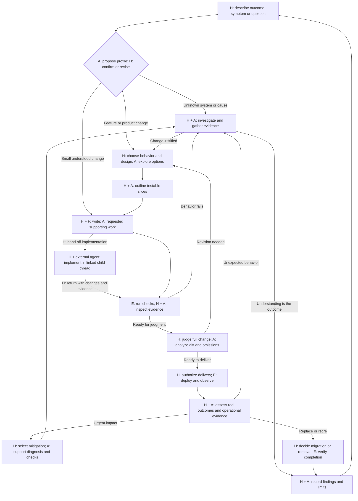
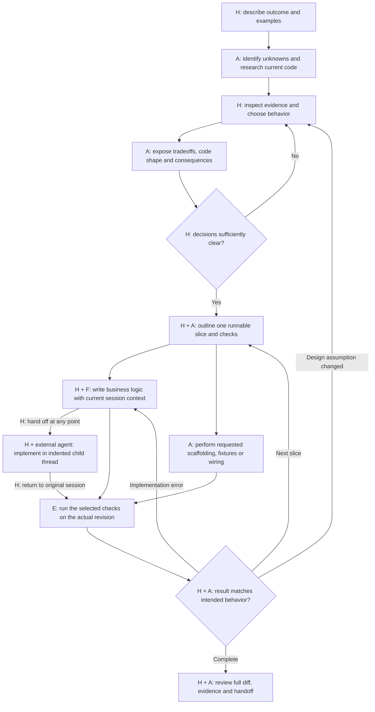
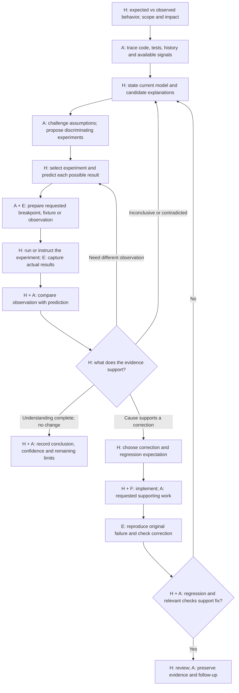
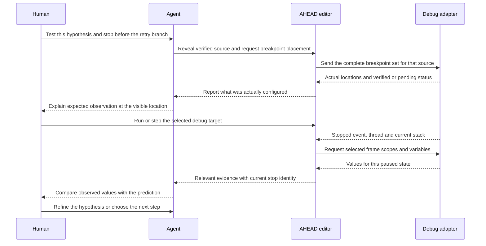
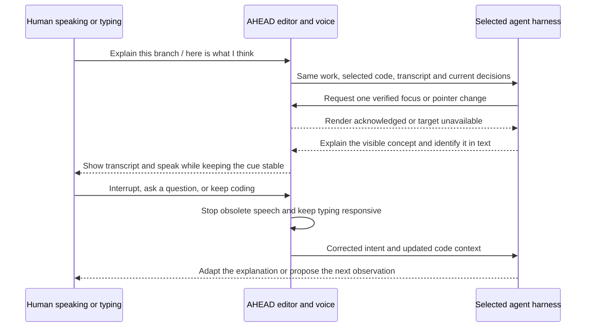
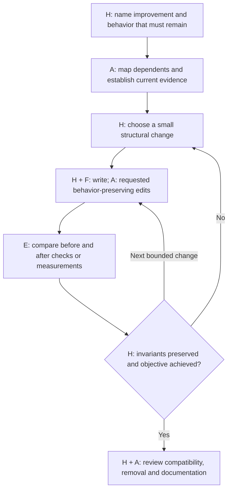
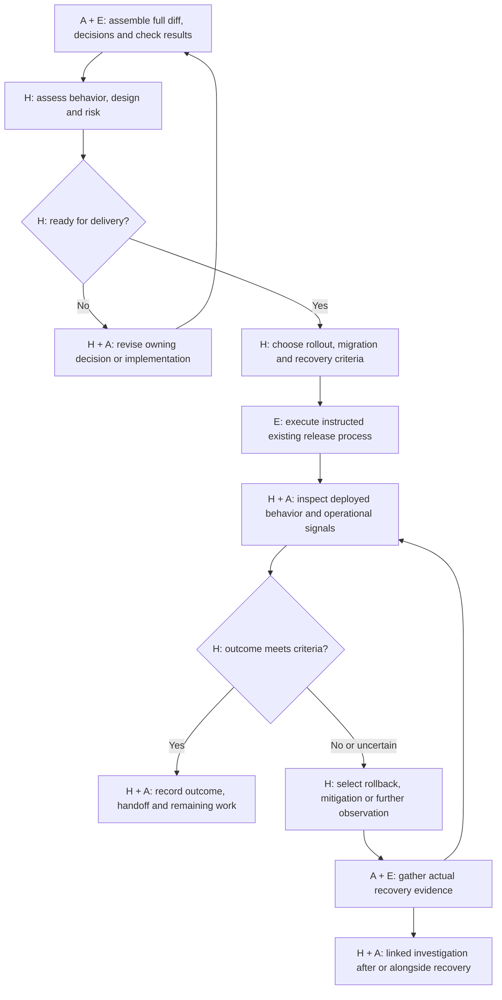
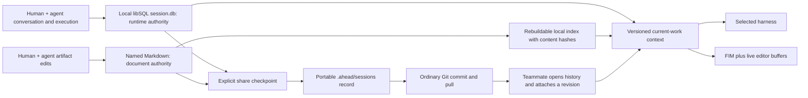

# AHEAD workflow atlas

Status: reviewable product design, 2026-09-22. The requirements in §1 come from the design conversation; the detailed flows and storage convention are proposals until reviewed. These diagrams describe intended behavior, not working product features. Implementation gaps belong in [TODO.md](../../TODO.md).

This is the entry point for reviewing workflows, human/AI responsibilities and SDLC coverage. [HumanLayer workflow research](ahead-humanlayer-workflows.md) records dated source observations and decision provenance; [Editor MVP](ahead-editor-mvp.md) contains architecture and FIM details. Keep normative flows and diagrams here rather than maintaining divergent copies in those documents.

## 1. Requirements and decisions

Record new agreements here as the design conversation continues. Distinguish a user requirement, an accepted design decision and a proposed default. When a choice changes, update its owning diagram and artifact convention in the same edit; do not leave a contradictory diagram as the apparent current design.

| ID | Status | Requirement or proposed choice |
|---|---|---|
| W1 | Required; delegation added 2026-10-01 | Humans own business behavior and, by default, write business logic with explicitly accepted FIM in assistance tasks. They may explicitly hand implementation to a linked external agent thread under W17. FIM receives current/open-file context plus the active work, decisions, plan and relevant attached history. Teaching tasks do not receive edit predictions. |
| W2 | Required | Preserve the selected harness's model-facing tools and loop behavior. **Updated 2026-09-22:** follow Zed's native-agent split exactly in shape—direct built-in loop through the AHEAD proxy; ACP only for external agent processes. The managed path owns the effect boundary; external ACP remains compatibility-only with no enforcement guarantee. Lifecycle policy and agent-advertised ACP modes are separate. See [native cutover](ahead-humanlayer-workflows.md#native-integration-cutover-2026-09-22). |
| W3 | Required | Use `.ahead` as a mixed project workspace: track non-secret project configuration, project artifact-template overrides and explicitly shared session checkpoints; ignore credentials, personal settings, databases, caches and private working sessions. Let developers browse and attach shared past sessions. |
| W4 | Required | Support voice conversation while coding, with Maieutic-style highlighting and pointing, and teaching from actual code. |
| W5 | Required | Diagram the flows and human/AI roles across the SDLC, including investigation and bug diagnosis. Preserve one discoverable, readable home for design artifacts. |
| W6 | Proposed detail | Let the agent place debugger breakpoints for a human-selected experiment. Preserve human breakpoints and distinguish editor configuration from running/stepping the program. |
| W7 | Settled 2026-09-22; document root clarified 2026-10-01 | Retain libSQL for live session state. Sessions create lasting, topic-named research/design/plan/verification/review Markdown in the configured project documentation root (default `docs/`), grouped by document purpose rather than session ID. |
| W8 | Proposed detail | Ordinary pointing never moves the human caret. Explicit navigation or an opted-in follow mode can move the view/caret; typing suspends following. |
| W9 | Proposed detail | Guided debugging uses user-directed execution by default. The agent may prepare a breakpoint, fixture or observation for a human-selected experiment; it does not silently step or run code. |
| W10 | Settled 2026-09-22; retention clarified 2026-10-01 | Working runtime state and conversation remain private by default. Archiving hides a session; 30 days later AHEAD deletes its database history, including comments and agent runtime records. Explicit session checkpoints remain separate exports under `.ahead/sessions/<id>/`; lasting documentation belongs under the configured documentation root and is not deleted with a session. Publication never silently commits files or includes credentials. |
| W11 | Settled 2026-09-21 | A session is a durable container, not a binary Learn/Assist mode. Each session contains explicit tasks: `teaching` when the human asks to learn, and `assistance` for everything else. A teaching task may be linked to an assistance task without changing the parent task's effect policy. |
| W12 | Settled 2026-09-21 | Integrate a graduated diagnosing-bugs workflow into corrective-debugging and investigation tasks: establish a red reproduction loop, minimize it, rank falsifiable hypotheses, instrument or test, fix with regression evidence, then clean up. Redact sensitive diagnostic evidence before persistence or sharing. |
| W13 | Settled 2026-09-21 | Ship AHEAD-owned skills as built-in `SKILL.md` bundles with startup metadata and progressive body/reference loading. The agent may select relevant assistance skills, but the session host enforces task policy, capabilities and human authorization. End-of-session automated review is a standard review step; it never auto-applies findings or publishes externally. |
| W14 | Settled 2026-09-21; root convention clarified 2026-09-23 | Follow the open `AGENTS.md` convention for project instructions and the portable Agent Skills package format. Discover workspace skills from `.agents/skills/` (the client guide's widely adopted cross-client location); user skills use AHEAD's `~/.agents/skills/` convention. This repository dogfoods those paths. Zed is a non-normative implementation reference: AHEAD does not load Zed `.rules` or other editor-specific instruction formats. Instructions and skills provide context only within AHEAD's rules; built-ins cannot be silently shadowed, discovered skills do not authorize effects, and scripts/network/credential/external-write behavior remains host-gated. See [the standards boundary](ahead-agent-standards.md). |
| W15 | Settled 2026-09-22 | Treat pull-request review as a distinct work type over an immutable base/head snapshot. A contributor may review the code and explicitly shared session artifacts, mark each artifact's review status and disposition, and record findings. AHEAD records reviewer identity, reviewer relationship to the implementers, revisions and policy context, then offers an advisory merge-readiness suggestion. The repository/team's normal PR requirements—including whether independent review is required—and the team's or solo contributor's merge timing remain authoritative; AHEAD neither requires a second person universally nor authorizes, blocks or performs the merge. |
| W16 | Required | Presentation Core is an editor capability available to every supported AHEAD agent implementation and version, across managed models/providers and external adapters. Agent adapters expose the same inspect, highlight, label/note, pointer and speech tools by forwarding requests to the editor; availability does not depend on teaching versus assistance intent. Presentation actions do not edit source files or move the human caret. |
| W17 | Settled 2026-10-01 | Human implementation remains the default. At any point during implementation, the human may hand work to a new external agent thread with the session context and work directly with that agent. Show it indented beneath the originating AHEAD thread in the unified sidebar. The human returns to the original thread for verification, review and the remaining workflow; child completion does not complete the parent. |
| W18 | Settled 2026-10-01; local slice implemented | Session participants select code and write comments in an editor popover. A gutter icon and range rail expose open comments; the session panel lists them for navigation, chat attachment and resolution. Comments retain author, range, quote and source hash and expire with the archived session after 30 days. Opening a changed source avoids selecting the stale range. Live multi-client sync, diff-hunk anchoring, stale-range relocation and explicit child-thread attachment remain implementation work. |

No diagram introduces per-edit approval cards. A human decision or instruction can be given naturally in text or speech; an already instructed action does not need another confirmation. External publication and execution remain within the actual instruction and runtime permissions.

## 1.1 Task intent replaces the session mode switch

A session is a durable container for work, conversation, artifacts and evidence. It
does not have a Learn/Assist toggle or a mode-selection prompt. Starting a session
asks for one freeform description of what the human is trying to accomplish. AHEAD
proposes a work profile and task intent from that request; the human can revise the
request or reject the proposal before the durable session starts. The first request
then creates an explicit task intent:

This intent-first flow applies only to managed AHEAD sessions. An external ACP
thread is deliberately a lightweight side thread: the human chooses an installed
ACP adapter and may provide an optional prompt, then the external agent owns its
workflow, model choice and effects. External threads remain visible in the unified
sidebar and conversation shell, but do not inherit AHEAD's profile review,
phase/step controls or enforcement claims. Implementation handoffs appear as
indented children of their originating AHEAD thread (W17); independently started
external threads remain separate entries.

- **Teaching:** the human asks to learn a concept, code path or skill. The task
  uses read-only context and presentation tools, records a learning arc, and
  keeps experiments and implementation under human control.
- **Assistance:** the default for every other request, including feature work,
  investigation, corrective debugging, review and operational support. The
  task receives the capabilities allowed by the current phase, policy, role and
  explicit scope.

“Teach me why this retry path behaves this way” creates a teaching task. “Debug
this retry path” creates an assistance task. “Teach me while we debug it” creates
an assistance task with a linked teaching arc; the debugging task remains the
parent for execution, hypotheses and regression evidence. Switching between
these requests does not create a new session or discard context.

The distinction is task-local, not a UI chip or session-wide state. The panel
should show the current task intent and inferred work profile in its review step,
header and conversation cards, but must not offer a binary session-mode control.
After the session starts, the agent helps the human turn an underspecified request
into a problem statement, constraints and a next step; that clarification does not
silently expand scope or transfer decision authority to the agent.

### 1.2 Implementation handoff and child threads

This supports users who prefer to "vibe code" the implementation while staying
involved throughout the work. The child conversation stays inside AHEAD;
"external" describes the agent runtime, not a move to another application.
Delegation changes who writes the code. The human still owns problem framing,
design decisions, acceptance criteria and review, with agent assistance. Choosing
agent-written implementation does not skip those parts of the AHEAD workflow.

The human can hand off a specific slice or the remaining implementation, including
after writing part of it. The external thread receives the outcome, decisions,
constraints, plan, relevant discussion and artifacts, current code state and
unfinished work. The human works with the external agent in that child thread and
can return to the parent at any time, including with a partial prototype.

Keep the child visually attached to its parent in the same sidebar list:

```text
Add workspace search
  └─ Prototype search implementation · External agent
```

The child remains a separate conversation with its own external agent controls.
The parent retains the AHEAD plan and review steps. On return, inspect the actual
changes, check results, deviations from the design and unresolved questions in
the parent. Revisit design when the prototype changes an assumption. Nesting does
not extend managed enforcement or guaranteed edit attribution to the external
agent.

Proposed first version: a context snapshot at handoff and a return-to-review
action, without continuous synchronization of two plans. Worktree isolation and
handling simultaneous edits remain open implementation choices.

## 2. SDLC map and responsibility legend

**H** = human engineer/team. **A** = conversational agent. **E** = editor, harness tools, debugger or checks returning actual results. **F** = FIM; it suggests at the caret and never applies on its own. Prefixes remain readable without color.

The workflow is iterative. Learning, voice, documentation, security, accessibility and collaboration apply throughout; they are not phases that wait until the end.



| SDLC concern | Human responsibility | Agent/editor contribution | Reviewable evidence |
|---|---|---|---|
| Discovery and requirements | Define problem, users, success and constraints | Find relevant prior work; clarify uncertainty; explore options | Brief, examples and open questions |
| Investigation and diagnosis | Build/assess the mental model; choose hypotheses and experiments | Trace code, point out counterexamples, prepare observation and summarize results | Findings, predictions, actual observations and limitations |
| Design | Decide behavior, tradeoffs and code boundaries | Compare alternatives; show diagrams, types and call paths | Design and attributed decisions |
| Planning | Choose slices, priorities and responsibility | Identify dependencies, files and checks | Plan with outcomes and verification |
| Implementation | Write business logic and accept FIM deliberately by default; explicitly choose any external handoff | Suggest at the caret; prepare instructed supporting edits; external agent implements delegated scope with the human | Diff, available authorship evidence and linked handoff |
| Verification | Define expected behavior; judge manual/exploratory results | Run instructed checks and expose failures | Code revision, check results and untested areas |
| Review and security/accessibility | Assess design, risk, usability and acceptance | Trace requirements to changes; challenge assumptions | Findings, dispositions and remaining risk |
| Release and migration | Select destination, rollout and recovery approach | Prepare/run instructed existing commands; gather outcomes | Release revision, migrations, observed behavior and rollback evidence |
| Operations and incidents | Prioritize service recovery and choose mitigation | Correlate signals; maintain timeline and test recovery | Impact, mitigation and recovery evidence; follow-up |
| Maintenance and retirement | Choose preserved invariants and migration/deletion criteria | Find dependents; compare behavior; verify cleanup | Invariants, migrated consumers and removal evidence |

This is coverage of the engineering work, not a promise that AHEAD supplies a CI service, deployment platform, observability backend or incident-management system. Link or use the project's existing tools.

## 3. Feature and product development

HumanLayer's RPI and PRD-Oriented paths inform this flow. Product and technical design can be one artifact for ordinary features. A larger change can split product behavior from system/program design. Quick changes enter at the relevant slice when intent is already clear; Freeform can stop at a useful finding. [HumanLayer workflow selection](https://docs.humanlayer.com/guide/skills-workflows).



The outline is the single plan card in the conversation. Parallel arrows show distinct responsibilities, not mandatory concurrent agents or permission to edit the same active buffer. Tests for chosen behavior must not become a way for the agent to invent the business specification.

The implementation handoff in §1.2 also applies to the human implementation
steps in the debugging and maintenance flows below. Their diagrams show the
default path; delegated work returns to the same verification and review steps.

## 4. Investigation and bug diagnosis

HumanLayer's current published catalog contains research, RPI/PRD-oriented planning, Freeform, Oneshot for clear small fixes, and implementation revision for bug reports. It does not list a dedicated hypothesis/experiment/debugger workflow. That is a bounded finding about the reviewed documentation, not proof that users cannot debug with the product. [Skill catalog](https://docs.humanlayer.com/reference/skills-workflows).

**Investigation** may finish with an explanation, disproven assumption or explicit unknown. **Corrective debugging** continues to a justified fix and regression evidence. A production symptom may require operational stabilization before either; not every incident is a software defect.



Record each meaningful experiment's question, hypothesis, predicted outcomes, target revision/environment, procedure, observation and resulting conclusion in `research.md`. Missing reproduction is a result to explain, not a reason to declare a fix. Avoid changing several suspected causes at once when that destroys the ability to interpret the experiment.

### 4.1 Graduated hard-bug diagnosis

AHEAD adopts the useful discipline from Matt Pocock's
[`diagnosing-bugs`](https://github.com/mattpocock/skills/blob/main/docs/engineering/diagnosing-bugs.md)
workflow for hard bugs and performance regressions. It is not required for a
simple explanation or an already-understood fix. The assistance task graduates
through these phases:

1. **Characterize the symptom:** expected versus observed behavior, scope,
   impact and environment.
2. **Build a red loop:** one named test, command, fixture, request, browser
   probe or replay that fails for the reported symptom and can later turn green.
3. **Minimize the loop:** remove parts that are not load-bearing and increase a
   flaky reproduction rate when necessary.
4. **Rank hypotheses:** list three to five explanations, each with a falsifiable
   prediction, before instrumenting or changing the suspected cause.
5. **Run the selected experiment:** the human chooses the experiment; AHEAD may
   prepare a breakpoint, fixture, logpoint or approved check and records the
   actual result.
6. **Correct and verify:** add the regression expectation, apply the bounded
   correction, rerun the original red loop and relevant checks, then remove
   temporary instrumentation.

If AHEAD cannot create a tight red loop, it stops before forming a confident
theory and records what is missing: environment access, a captured artifact,
an observable seam or permission to add temporary instrumentation. A missing
reproduction is an honest finding, not permission to guess.

Diagnostic commands, logs, HAR files, traces and captures are sensitive by
default. Keep raw evidence local where possible; redact credentials, tokens,
cookies, personal data and unrelated payloads before putting excerpts in the
conversation, `research.md`, a shared checkpoint or a tracker update.

When the learner asks for explanation during this loop, attach a teaching arc
to the assistance task. Use the same verified code ranges and experiment
evidence, but do not let the teaching arc claim that a hypothesis is true until
the selected experiment supports it.

Example: intermittent duplicate requests. The engineer predicts that a particular retry branch executes twice; the agent locates the branch and places a requested breakpoint/logpoint. The observed call stack may instead reveal two callers. That finding updates the model before either participant starts changing the retry rule.

## 5. Guided debugger interaction

The agent can help set up observation without taking over the engineer's reasoning. Reuse the existing DAP route; do not add a second debugger protocol. DAP provides capability negotiation, breakpoint responses and paused-state inspection. [DAP overview](https://microsoft.github.io/debug-adapter-protocol/overview).



Proposed interaction rules:

- Place/remove an agent-owned breakpoint when instructed, including through voice. A selected guided experiment can cover several necessary placements; no per-breakpoint approval dialog is needed. Do not delete or overwrite the human's breakpoints.
- The editor owns the combined breakpoint set. DAP `setBreakpoints` replaces the set for one source; reconcile all owners before sending it. Show verified, pending, relocated and failed bindings honestly. Conditions, hit counts and logpoints depend on adapter support.
- Breakpoint setup does not authorize launch, attach, resume or arbitrary evaluation. In a teaching task the human controls execution; in an assistance task explicit run/step instructions can use the existing execution path. Explain expressions without invoking functions or changing variables merely to obtain a nicer explanation.
- Bind observations to the target, thread, frame, paused state and source revision. DAP variable references expire on resume; stale observations may be retained as historical evidence but not presented as current values.
- Dirty editor text may differ from the running binary/source map. Show that mismatch and use the actual mapped breakpoint; never pretend an unsaved line was executed. If a needed adapter/capability is absent, retain the investigation and offer an ordinary test/logging path.
- At the end of an experiment, remove only temporary agent-owned breakpoints unless the user keeps them. Preserve human changes made during the experiment.

These are proposed debugger defaults. They extend the presentation experience; they are not evidence that agent-directed debugging works today.

## 6. Teaching and talking while working

The local [Maieutic README](../../../vscode-maieutic/README.md) and [focus controller](../../../vscode-maieutic/src/focus-controller.ts) establish the reference behavior: `focusContent`, `pointAtContent`, and `clearFocusContent` use a separate decoration and preserve the user's selection/caret. AHEAD's `PresentationCue` already describes that separation. Reuse the behavior through native GPUI views; do not copy the old host dependency or its approval-card assumptions.



Presentation Core is an editor tool surface, independent of the agent runtime.
Every supported AHEAD agent implementation and version exposes the same
`read_editor_buffer`, `present_code`, `move_code_pointer`,
`clear_presentation`, `speak_text`, and `stop_speaking` schemas. The editor
capability is available across supported harnesses and providers, and is not
gated on teaching intent. Managed agent tools
and external ACP stdio MCP sessions currently adapt that shared contract;
future adapters must reuse its schemas and argument validation rather than
copying a runtime-specific version; the reusable API is
`ahead_agent::editor_tools`. `read_editor_buffer` returns the
current unsaved contents of an open,
non-private worktree file, so the agent can verify a quote before pointing.
AHEAD supplies the stdio MCP server in every ACP session, and it routes through
a local, session-scoped bridge to the same editor request path. `present_code`
opens a worktree file, checks the exact quote against the current editor buffer, draws
a GPUI decoration and inline note from a `PresentationCue`, and acknowledges on
the next rendered frame. It does not call `set_cursor_position` or
`window.focus`. `move_code_pointer` resolves a second exact quote in the same
active cue and moves only the agent arrow; the original range highlight and
inline note remain in place. Both editor actions preserve the human selection
and acknowledge after the updated frame. Pointer movement, cue-specific clear,
and cue-linked speech are limited to cues created by that session; each queued
editor action is checked against both its session and active turn, so cancelled
or superseded turns are rejected too. Switching sessions stops
speech and microphone capture, drops that session's transcript drafts, and clears
its cue. The speaker uses macOS `/usr/bin/say`; typing in the editor or
agent composer, changing a breakpoint, or using a debugger control interrupts
playback without cancelling the agent turn. The microphone path uses AVAudioEngine
and Apple's Speech framework on macOS, requires the current language to support on-device
recognition, and explicitly requires on-device requests so microphone audio is
not sent to a speech service. Partial text is shown as the user speaks; each
final transcript stays as a draft until the user adds it to the composer,
reviews or corrects it, and sends it through the selected harness. These are
source-level behaviors; the interactive native and ACP journeys still need
validation, including OS permissions and unavailable on-device languages.
Session code comments are persistent until the session expires; presentation
code notes remain transient and serve a separate teaching purpose.

Teaching tasks can use a small loop: **human prediction/explanation → verified visible example → agent hint or challenge → human experiment/explanation → evidence and next concept**. Ask a useful question when it develops understanding; answer straightforward factual questions directly. The former extension's exact word limits and mandatory quiz cadence are not automatically AHEAD requirements.

Voice is an input/output channel for the same work, not a competing engineering authority. The speech frontend must not invent code observations or decisions while a different coding harness works. Keep visible, correctable transcripts; speak from verified context and acknowledge a visual change before claiming it is on screen. Preserve microphone input during speech and editing. Barge-in stops obsolete speech; it does not silently cancel a test or resume a paused program. “Stop talking,” “cancel that task” and “pause the program” are distinct intents; clarify an ambiguous “stop” when the target matters.

Use a separate range highlight, agent pointer and debugger execution marker. Explicit “take me there” or opted-in follow mode can navigate; ordinary pointing never steals the insertion caret. Pause following when the user types and offer return to the previous location. Explain the same location in text for keyboard/screen-reader users. Do not use intrusive file banners.

In assistance tasks, the human continues typing with session-aware FIM during conversation. In teaching tasks, retain the no-generated-implementation/FIM-off default; the learner types and controls tests/debug execution. Breakpoint configuration in a teaching task is a presentation aid, not a relaxation of its execution boundary.

## 7. Maintenance and refactoring



If work discovers a required behavior change, return to design and make it explicit. Performance work records the measurement conditions; cleanup does not count as an improvement merely because the diff is smaller.

## 8. Review, delivery and operation



For an incident, service recovery can precede a known root cause. Keep recovery evidence and the later causal investigation distinguishable. A build, a passed test or a deploy command exiting successfully is not proof of observed production behavior. For retirement, use the same review/delivery loop with consumer migration, data retention and removal criteria instead of a feature rollout.

### 8.1 Pull-request review and merge readiness

Pull-request review is a separate human work type, not an extension of the agent's
implementation turn. The reviewer opens a base/head pair (or a local equivalent)
and AHEAD freezes the repository, commit/tree revisions and full-file context used
for the review. The source PR or provider status may be linked when available, but
an AHEAD record is not silently treated as a provider review.

The reviewer may be the implementer, another contributor or a designated team
reviewer. AHEAD records the relationship rather than imposing a universal
two-person rule. If the repository requires independent review, CODEOWNERS, a
number of approvals or another branch-protection rule, that requirement remains a
team/repository responsibility. A solo workflow can satisfy AHEAD's recordkeeping
without being mislabeled as independent review.

Only explicitly shared session checkpoints are attached to the PR review. Each
attached artifact is pinned to its revision and can be marked:

| Artifact review status | Meaning |
|---|---|
| `unreviewed` | Attached for context, but the reviewer has not assessed it. |
| `reviewed` | The reviewer assessed it against the current change and found no required correction in that artifact. |
| `needs-changes` | The artifact or its relationship to the change needs correction or another decision. |
| `not-applicable` | The reviewer recorded why this artifact does not apply to this change. |

Code and artifact findings retain their author, anchor or artifact revision,
severity, disposition and later response. The agent can explain the diff, compare
it with the pinned decisions and produce attributed findings, but it cannot supply
the final review, approve its own work or resolve a human finding on the human's
behalf.

Under W18, a participant selects a code range and writes the comment in a
floating editor card. A gutter icon marks its start, a rail marks its covered
lines, and a cap marks its end. Clicking the icon opens the card for reading,
resolution or attaching a stable reference to the human/agent chat. The session
panel lists open comments and can navigate back to the editor card. The stored
quote and source hash identify the revision being discussed; when the source
hash changes, navigation opens the original line without selecting stale code.
Resolved comments disappear from the gutter and open-comments list but remain
in session history until archive expiry. The UI does not yet relocate stale
ranges, anchor diff hunks or sync automatically across clients; collaborators
can refresh the list. A linked implementation child receives a comment only
when a human explicitly carries its reference into that chat; review
disposition stays in the originating AHEAD session.

AHEAD can suggest **ready for team merge consideration** only from current,
revision-pinned evidence: review statuses are resolved, required AHEAD findings
have dispositions, the snapshot is not stale, and known checks are recorded. A
missing provider check or an unconfigured team rule remains `unknown`, not
implicitly passing. The suggestion is advisory. Normal PR tooling and team policy
decide required approvals, CI, branch protection, release controls and when to
merge; AHEAD does not add a merge button or dictate merge timing.

## 9. Storage and artifact convention

The current store already uses Turso's `libsql` and opens `.ahead/session.db`. Retain that installed database path and library unless a measured need requires changing them. This selects local Turso/libSQL, not Turso Cloud or a separate database engine. [libSQL distinction](https://docs.turso.tech/libsql).

The session database is transactional and queryable, not a plain-text document format; it does not guarantee fewer bytes than Markdown/JSON. Measure real histories before claiming a size benefit.

**Canonical split:** database for session runtime state; ordinary Markdown for lasting engineering documents. The database stores conversation/events, current runtime references, local UI state and rebuildable search indexes. Documents are topic-named and grouped by purpose in a project documentation root, default `docs/`. Set `[documentation] root = "engineering"` in tracked `.ahead/config.toml` to use another workspace-relative root. The session context passes this root to the managed agent and FIM; the human and external agent may create documents there during work. A session ID is provenance, not a documentation directory.

`.ahead` is deliberately not wholly ignored. Its boundary is allowlist-based so a
new private runtime file cannot become shareable merely because it was added under
that directory:

| Path | Git policy | Purpose |
|---|---|---|
| `.ahead/.gitignore` | tracked and created on project setup/open | Default-deny boundary that travels with the project without changing its root `.gitignore`. |
| `.ahead/config.toml` | tracked | Non-secret project workflow/editor/provider defaults; MCP declarations remain inert until local opt-in. |
| `.ahead/templates/` | tracked when present | Project overrides for built-in artifact templates. |
| `.ahead/sessions/<id>/` | tracked when explicitly published | Portable session checkpoint and selected human-readable artifacts. |
| `docs/{research,design,plans,verification,reviews}/` by default | tracked when committed | Canonical lasting documents, named for their subject. `[documentation].root` changes the root. |
| `~/.ahead/settings.toml` | outside the repository | Private user-level defaults and credentials. |
| `.ahead/settings.toml` | ignored | Workspace-private AI connections, credentials and personal overrides. |
| `.ahead/config.local.toml` | ignored | Checkout-specific non-secret overrides. |
| `.ahead/local/`, `.ahead/session.db*`, `.ahead/auth.json` | ignored | Private working documents, runtime history, caches and credentials. |

**Proposed MCP default:** use an AHEAD-owned `[mcp.servers.<id>]` settings shape
that maps to MCP's standard transports; do not claim compatibility with a
private editor config format. Require explicit local opt-in in
`.ahead/settings.toml` or `~/.ahead/settings.toml`; never auto-launch a server
from tracked config. This is a proposed config contract, not a working
server-launch path. The native host must keep MCP unavailable in Learn until it
can enforce read-only behavior for external server effects; MCP writes are not
AHEAD CodeAnchors. See the [agent standards boundary](ahead-agent-standards.md#protocols).

Built-in artifact templates live in `defaults/artifacts/`. A project may override
a template by placing a file with the same name in `.ahead/templates/`; it need
not copy every built-in template. Templates are prompts for useful records, not
forms that must be filled completely.



Standard paths and roles:

```text
docs/                             configurable lasting-document root
  research/                       topic-named research documents
  design/                         topic-named design and decision documents
  plans/                          topic-named implementation plans
  verification/                   topic-named check and outcome records
  reviews/                        topic-named review findings
.ahead/
  config.toml                       shared project/editor/workflow defaults
  templates/                        optional shared project template overrides
  config.local.toml                 ignored checkout-specific overrides
  settings.toml                     ignored workspace credentials/personal settings
  session.db                       ignored live database, plus its sidecars
  sessions/<id>/                   explicit portable session checkpoint
    session.json                   session snapshot, including code comments
    session.md                     readable session summary
    conversation.jsonl             exported message history
    code-comments.md               exported code comments when present
```

Do not precreate empty document directories or templates. A session creates a
document when the work has lasting research, design, plan, verification or
review content; its filename names the subject, not the session. The explicit
checkpoint is a snapshot of session history, not the working document root.

For implementation handoffs, persist the parent/child relationship so the sidebar
can restore it after reopening. Include the code baseline and any unfinished
work in the handoff context. On return, record lasting decisions and verified
outcomes in the relevant topic documents. Handoff context remains private;
creating a child does not publish documentation to Git or include credentials.

Record human decisions and accepted uncertainty at the point they are made;
record AI research with sources and clear fact/inference boundaries; record plan
deviations while implementing; and record actual checks and observed outcomes
without turning passed commands into deployment claims. Keep diagram source in
Markdown/Mermaid; generate rendered outputs only when useful. The current MVP
export materializes `session.json`, `session.md`, `conversation.jsonl` and, when
present, `code-comments.md` under `.ahead/sessions/<session-id>/`. Automatic
document creation, selected conversation export and revision-pinned attachments
remain implementation work.

Each lasting document has one canonical file path in the documentation root. Sharing it uses ordinary Git review; a session checkpoint is separate history, not a second editable copy. If a file is edited externally, index the new revision and surface conflicts with unsaved editor content; never overwrite it from a stale database cache.

Human and agent UI links should open the same canonical document. Session context names the configured root; agents do not guess the newest filename or inspect arbitrary database internals. FIM reads compact context from documents and the active session. Save lasting decisions before session history expires. Pin attached past-session evidence to its source revision; importing it must not revive old grants or execute old commands.

After archive, the complete session database record is retained for 30 days and then purged on the next session-store activity. Explicitly exported checkpoints and topic documents are independent files and are not part of that purge; users decide what to retain in Git. A database backup can remain an optional complete local archive. Do not use the live Turso database file as the default Git interchange format or claim history is complete after pruning it.

This replaces the earlier session-directory proposal for lasting documents. AHEAD creates `.ahead/.gitignore` when a project is set up or opened, but never overwrites an existing file. Its default-deny boundary explicitly permits shared configuration, template overrides and explicitly exported session checkpoints. Runtime databases and credentials remain excluded without modifying the project's root `.gitignore`.

## 10. Implementation status and review scenarios

Source inspection and focused validation through 2026-09-22:

- **Harness (updated 2026-09-22):** following Zed commit
  `418f89714891f9d8105a3e92e60b9a7a5084d232`, built-in AHEAD chat now calls the
  hard-forked native `ThreadManager` through `ahead-agent/src/native_client.rs`;
  it does not use ACP or a Codex App Server. The focused real Responses test
  verifies a native streamed turn. Plans, usage, stable tool ids, reasoning,
  cancellation and `request_user_input` are routed into the durable panel.
  `ahead-agent/src/acp_client.rs` is now external-only and supports streamed
  messages/thoughts, stable tool updates, plans, usage, titles and advertised
  slash commands. Pi ACP reaches initialize, session creation, command discovery
  and prompt completion; its final model delta is blocked by an expired local Pi
  bearer token. Multi-tool native turns, compaction and unsaved-buffer reads still
  need authenticated acceptance evidence.
- `ahead-proxy/src/ahead/store.rs` and `ahead-proxy/src/dispatch.rs` already provide the local libSQL store and `.ahead/session.db` path. `dispatch.rs` now surfaces an open failure instead of silently presenting an in-memory store as durable, but full message/artifact sharing and canonical working-document synchronization remain incomplete.
- `ahead-rpc/src/ahead.rs::PresentationCue` already separates agent highlighting from the human caret. The complete visible cue/voice interaction is not established by that DTO.
- `ahead-proxy/src/plugin/dap.rs`, `ahead-rpc/src/dap_types.rs`, `ahead-app/src/debug_bar.rs` and `ahead-app/src/proxy_client.rs` contain DAP machinery. The current client reduces breakpoint responses to line numbers and flattens stopped frames; it does not yet establish the ownership, binding state and stop identity required above. The debug bar also initializes an illustrative active line rather than proving current-caret targeting.
- `ahead-proxy/src/ahead/voice.rs` identifies itself as a runtime probe. Queue-generation tests are not evidence of working microphone capture, playback or synchronized teaching in the editor.
- `ahead-app/src/session_panel.rs` is bound to the real streamed harness conversation (proxy `AgentTurnStart`/`AgentTurnCancel`/`AgentTurnRetry`, 250 ms delta polling, durable reopen and explicit interrupted-turn retry) instead of keyword-mocked replies. A headless GPUI test verifies the interactive agent-question state; the complete rendered journey still needs a running-window pass.

Review the design against these concrete journeys before implementing a generic workflow system:

1. A feature starts from a human outcome, reaches one runnable slice, gets session-aware FIM and resumes with its decisions intact.
2. An investigation disproves a suspected cause and ends without a code change; its conclusion remains useful to a teammate.
3. A bug experiment places a breakpoint while preserving a human breakpoint in the same file, reports an unbound breakpoint honestly, observes a real stop and produces regression evidence.
4. A learner talks over an explanation while typing; stale audio stops, their caret stays put, the current cue remains meaningful, and no debugging execution happens merely from a voice interruption.
5. A teammate pulls shared history, opens the standard documents and attaches one decision; a later source update does not silently change that attachment.
6. A refactor preserves its stated invariants; a design change is sent back to a human decision rather than hidden in cleanup.
7. A passed CI run is followed by a failed rollout; the workflow records actual recovery and keeps causal follow-up open.
8. A retirement identifies consumers and data handling, verifies migration/removal and retains the rationale for future investigation.

The first deliverable remains a small usable editor journey. This atlas defines coverage and responsibilities; it does not require building every integration at once.
