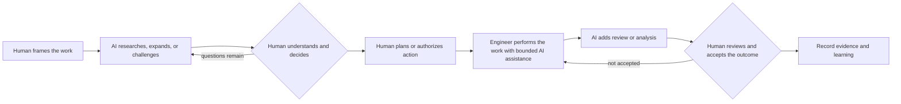

# AHEAD Pilot Workflows

Status: pilot v0.1

## Purpose

These six minimal workflow profiles are meant to be used on real engineering work before AHEAD builds a workflow engine, editor extension, or CI enforcement. They are deliberately small. The pilot should reveal which phases, gates, and records improve reasoning and which create process burden.

The profiles are:

1. [Product change](product-change.md)
2. [Corrective debugging](corrective-debugging.md)
3. [Operational stabilization](operational-stabilization.md)
4. [Decision](decision.md)
5. [Investigation](investigation.md)
6. [Internal improvement](internal-improvement.md)

Choose the flow by its dominant outcome, not by the issue label. Incident, emergency, security, regulatory, and other concerns are overlays or modifiers.

## Shared pilot contract

Every pilot run has:

- one accountable human owner;
- a stated outcome or question;
- a selected workflow and relevant modifiers;
- a human-originated initial understanding before AI expansion;
- links to material evidence rather than unsupported summaries;
- visible facts, inferences, unknowns, decisions, and accepted risks;
- recorded AI contributions when they materially influence the work;
- human authorization for consequential actions;
- independent human review where a lasting change is produced;
- outcome evidence and a human closure decision.

Phases may loop or reopen. A workflow is not invalid merely because learning changes an earlier decision or plan. The record should make the change visible.

## Common human gates

| Gate | Required when | Minimum evidence |
|---|---|---|
| Framing accepted | Every run | Human-owned outcome, question, failure, or invariant |
| Decision accepted | A course or intervention is selected | Chosen option, rationale, tradeoffs, unknowns, and accountable human |
| Plan accepted | Before a lasting implementation | Human first-pass plan plus accepted AI challenges or additions |
| Action authorized | Before a consequential, risky, destructive, or production action | Actor, purpose, scope, blast radius, rollback or containment, and authorization |
| Human review accepted | Before accepting a lasting engineering change | Review of the current changeset and material evidence |
| Outcome accepted | Before closure | Verification against the original outcome plus remaining uncertainty and follow-ups |

Emergency policy may defer nonessential documentation, but it does not remove authorization or accountability. Deferred reasoning is reconstructed after stabilization.

## Minimal run record

For the pilot, keep one Markdown file per run. A team can place it in `.ahead/runs/<id>.md`, an issue, or another durable system as long as links and revision history remain available.

```yaml
id: AHEAD-YYYY-NNNN
title: Short description
workflow: product-change | corrective-debugging | operational-stabilization | decision | investigation | internal-improvement
owner: human identity
status: active | blocked | complete | abandoned
modifiers:
  urgency: normal | expedited | incident | emergency
  assurance: standard | security | regulated | safety-critical
  environment: local | test | staging | production | external
links: []
```

The body records only the sections required by the selected flow. Evidence may remain in its native system and be linked rather than copied.

## Shared human–AI rhythm



## Pilot feedback

For each completed run, record:

- which phase or gate prevented a mistake or improved understanding;
- which required record was unused or burdensome;
- where the team could not agree on routing or completion;
- where AI helped, anchored, distracted, or weakened learning;
- what was reconstructed after the fact;
- what the eventual engine should enforce, warn about, or leave to judgment.

These profiles are AHEAD design hypotheses. Using them is how AHEAD will learn whether the six-flow taxonomy and its gates deserve stronger enforcement.
