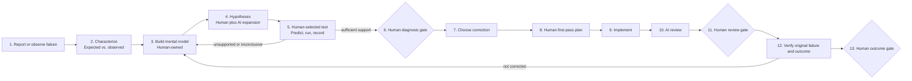

# Corrective Debugging Workflow

Status: pilot v0.1

## Outcome

Use this flow when observed behavior conflicts with intended behavior and the dominant work is causal diagnosis plus correction. It ends with a verified correction or an explicit human acceptance of remaining uncertainty.

Use operational stabilization instead when a live system is unhealthy and restoration or convergence is the immediate objective.

## Lifecycle

Reproduction is useful but not a universal gate. Historical, intermittent, production-only, or already mitigated failures may proceed when the limitation is recorded.

## Minimal phases

| Phase | Human owns | AI may | Minimum record | Advance when |
|---|---|---|---|---|
| Report and characterize | Intended behavior, observed behavior, impact, scope, and evidence quality | Organize evidence and identify missing characterization | Failure statement and evidence links | The failure is bounded enough to investigate |
| Mental model | Current explanation of relevant components, state, and interactions | Explain unfamiliar mechanisms and challenge omissions | Model, assumptions, and unknowns | The model can generate testable hypotheses |
| Hypothesize and test | Hypothesis selection, test authorization, prediction, and interpretation | Generate alternatives, evidence for/against, and discriminating tests | Facts, inferences, hypotheses, predictions, tests, results, confidence | Human accepts a diagnosis or explicitly accepts uncertainty |
| Choose correction | Desired correction and tradeoffs | Compare fix approaches and recurrence risks | Selected correction and rationale | Human approves the correction |
| Plan | First-pass correction and verification plan | Find missing cases, risks, regression tests, and rollout concerns | Plan and rollback or containment needs | Human approves the plan |
| Implement | Code and engineering changes | Bounded implementation and debugging assistance | Linked changeset and regression evidence | Change is ready for review |
| Review | Resolution and final engineering judgment | Perform first-pass review | AI findings plus current human review | Human accepts the current change |
| Verify outcome | Original failure, regression protection, deployed behavior when applicable | Suggest checks and analyze authorized evidence | Pre-change comparison, fix validation, and observed outcome | Human accepts correction or reopens investigation |

## Evidence chain

```mermaid
flowchart LR
    OBS["Observed failure"] --> FACTS["Facts and evidence"]
    FACTS --> MODEL["Mental model"]
    MODEL --> HYP["Competing hypotheses"]
    HYP --> TEST["Prediction, test, result"]
    TEST --> CONC["Human conclusion with confidence"]
    CONC --> FIX["Correction decision and plan"]
    FIX --> CHANGE["Change and reviews"]
    CHANGE --> VERIFY["Failure-specific and deployed verification"]
```

## Non-waivable pilot rules

- Facts, inferences, and hypotheses remain distinguishable.
- AI hypotheses are candidates, not diagnoses.
- The human chooses or authorizes tests and interprets their results.
- A plausible cause is not treated as proven.
- Fix validation and post-deployment outcome verification are distinct when deployment applies.

## Pilot questions

- What was the minimum useful investigation record?
- Did recording predictions before tests reduce hindsight interpretation?
- When was correction justified without a conclusive cause?
- Did AI broaden hypotheses or anchor the investigator?
