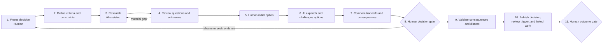

# Decision Workflow

Status: pilot v0.1

## Outcome

Use this flow when the deliverable is an accountable human choice among alternatives: architecture, buy versus build, technology selection, platform direction, policy, or another consequential course.

Implementation is optional and normally belongs in a linked product-change or internal-improvement run.

## Lifecycle

## Minimal phases

| Phase | Human owns | AI may | Minimum record | Advance when |
|---|---|---|---|---|
| Frame | Decision to be made, accountable decider, scope, deadline, and stakeholders | Clarify ambiguity and identify missing stakeholders | Decision statement and owner | Human accepts the frame |
| Criteria | Goals, constraints, evaluation criteria, and relative importance | Challenge hidden criteria and identify tensions | Criteria and non-negotiable constraints | Criteria are sufficient for comparison |
| Research and questions | Evaluation of evidence and disposition of uncertainty | Gather cited evidence, find alternatives, contradictions, and missing questions | Sources, findings, unknowns, and limits | Material evidence is reviewed or uncertainty accepted |
| Options | At least one human-originated option | Expand, combine, challenge, and propose alternatives | Options with provenance | Plausible option space is understood |
| Compare | Interpretation of tradeoffs | Structure comparison and sensitivity analysis | Benefits, costs, risks, consequences, reversibility | Decision is ready for accountable judgment |
| Decide | Selection, rationale, accepted tradeoffs, and dissent | Test rationale for inconsistency or missing consequence | Decision and rejected alternatives | Accountable human approves a specific revision |
| Validate and publish | Consequence check, communication, review trigger, and linked work | Summarize and propose validation checks | Consequences, reversibility, review trigger, links | Decision is published and accepted as current |

## Decision evidence chain

```mermaid
flowchart LR
    FRAME["Decision frame"] --> CRIT["Criteria and constraints"]
    CRIT --> EVID["Evidence and unknowns"]
    EVID --> H["Human initial option"]
    H --> OPTIONS["Expanded option set"]
    OPTIONS --> TRADE["Tradeoffs and consequences"]
    TRADE --> DEC["Human decision and rationale"]
    DEC --> REVIEW["Reversibility and review trigger"]
    REVIEW --> LINKS["Linked implementation or investigation"]
```

## Non-waivable pilot rules

- The accountable human defines the decision and evaluation criteria.
- A human contributes an initial option before AI expands the option set.
- AI does not select, approve, or manufacture consensus.
- Unknowns and dissent are not erased by polished rationale.
- The decision records when and why it should be revisited.

## Pilot questions

- Did human-first option generation preserve useful diversity?
- Were the criteria defined before a preferred answer emerged?
- Which evidence actually changed the decision?
- Did the review trigger cause a stale decision to be revisited?
