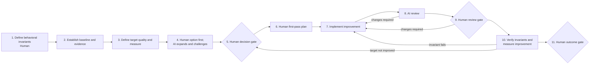

# Internal Improvement Workflow

Status: pilot v0.1

## Outcome

Use this flow when externally required behavior should remain invariant while an internal quality improves: maintainability, comprehensibility, performance, reliability margin, operability, testability, cost, or preventive risk reduction.

Use product change when externally meaningful behavior is intentionally changing, or corrective debugging when an observed defect is the reason for the work.

## Lifecycle

## Minimal phases

| Phase | Human owns | AI may | Minimum record | Advance when |
|---|---|---|---|---|
| Invariants | Behavior that must remain unchanged, scope, and non-goals | Identify overlooked contracts and consumers | Explicit invariants and exclusions | Human accepts the preservation contract |
| Baseline | Current quality evidence and measurement validity | Gather metrics and identify measurement gaps | Tests, measurements, structural evidence, or observations | Baseline is credible enough for comparison |
| Target | Quality to improve, success threshold, and tradeoffs | Suggest measures and unintended effects | Target quality and acceptance signal | Improvement can be evaluated |
| Options and decision | Initial approach, selection, and risk | Expand alternatives, expose coupling, and challenge abstraction | Options, decision, and rationale | Human approves the approach |
| Plan | First-pass sequence, verification, and rollback | Find affected boundaries, migration needs, and missing tests | Plan and invariant checks | Human approves the final plan |
| Implement | Engineering change and scope control | Bounded refactoring, explanation, tests, and mechanical assistance | Linked changeset and deviations | Change is ready for review |
| Review | Final judgment about simplicity, coupling, risk, and preservation | Review for hidden behavior changes and incidental complexity | AI findings and current human review | Human accepts the current change |
| Verify | Invariant preservation and target-quality comparison | Analyze measurements and suggest negative checks | Before/after evidence and invariant results | Preservation and improvement are demonstrated or failure is accepted |
| Outcome | Acceptance, rollback, partial result, or new work | Summarize learning | Outcome, remaining debt, and follow-ups | Human accepts closure |

## Preservation and improvement chain

```mermaid
flowchart LR
    CONTRACT["Behavioral invariants and non-goals"] --> BASE["Before baseline"]
    BASE --> TARGET["Target quality and measure"]
    TARGET --> DEC["Approach and rationale"]
    DEC --> CHANGE["Plan and changeset"]
    CHANGE --> REV["AI and human review"]
    REV --> INV["Invariant verification"]
    INV --> COMP["Before/after comparison"]
    COMP --> OUT["Human outcome and remaining debt"]
```

## Non-waivable pilot rules

- Invariants are stated before the change.
- Passing existing tests alone does not prove preservation when those tests do not cover the contract.
- AI may propose a refactor; humans decide whether it reduces conceptual complexity.
- File movement or abstraction count is not itself an improvement.
- The outcome compares before and after evidence against the declared target.

## Pilot questions

- Were the invariants specific enough to catch unintended behavior changes?
- Did the selected measure reflect the quality people actually wanted?
- Did the work reduce conceptual complexity or merely rearrange it?
- When did an internal improvement reveal that a product change or bug flow was needed?
