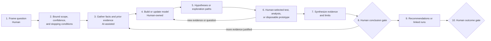

# Investigation Workflow

Status: pilot v0.1

## Outcome

Use this flow when the primary deliverable is knowledge or reduced uncertainty and no intervention has yet been selected. It may answer feasibility, causal, capacity, vendor, architectural, or technical questions.

An investigation may end with no action, insufficient evidence, several viable interventions, or work routed to another flow.

## Lifecycle

Full vibe coding is permitted for an isolated, explicitly disposable prototype when its purpose is learning. The learning is retained; prototype code is discarded or deliberately re-enters the appropriate production workflow.

## Minimal phases

| Phase | Human owns | AI may | Minimum record | Advance when |
|---|---|---|---|---|
| Frame | Question, decision relevance, audience, scope, and initial understanding | Clarify ambiguity and identify adjacent questions | Primary question and why it matters | Human accepts the question |
| Bound | Confidence needed, exclusions, time or evidence budget, and stopping conditions | Challenge whether the question is answerable | Scope, limits, and stopping rule | Investigation can proceed without unbounded research |
| Gather | Source evaluation and evidence access | Locate, summarize, compare, cite, and expose conflicts | Evidence links, source quality, and observations | Relevant available evidence is assembled |
| Model and explore | Mental model, path selection, test authorization, and interpretation | Generate hypotheses, analysis approaches, or prototype ideas | Model, assumptions, hypotheses, tests, and results | Evidence is sufficient for synthesis or budget is reached |
| Synthesize | Meaning, confidence, contradictory evidence, and limitations | Organize findings and challenge overclaiming | Findings, confidence, limits, and unknowns | Human can state a bounded conclusion |
| Conclude and route | Accepted conclusion, recommendation, and next workflow | Suggest follow-up questions or routes | Conclusion and linked decision/change/debug/improvement runs | Human accepts closure or explicitly extends the investigation |

## Knowledge chain

```mermaid
flowchart LR
    Q["Question and relevance"] --> SCOPE["Scope and stopping rule"]
    SCOPE --> E["Evidence and source quality"]
    E --> MODEL["Model and assumptions"]
    MODEL --> EXP["Hypotheses, analyses,<br/>tests, or prototypes"]
    EXP --> RESULT["Results and contradictions"]
    RESULT --> CONC["Human conclusion,<br/>confidence, and limits"]
    CONC --> ROUTE["Recommendation or linked run"]
```

## Non-waivable pilot rules

- The question is human-owned; AI does not quietly redefine it.
- Facts, retrieved claims, inference, and AI synthesis remain distinguishable.
- Important citations are followed to authoritative sources.
- A prototype demonstrates only what it actually tested.
- “Insufficient evidence” is a valid result.

## Pilot questions

- Were the stopping conditions usable or did research expand indefinitely?
- Did the conclusion state confidence and contradictory evidence honestly?
- Did a disposable prototype answer the learning question without leaking into production?
- Was the next workflow clear when the investigation ended?
