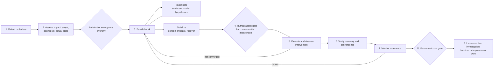
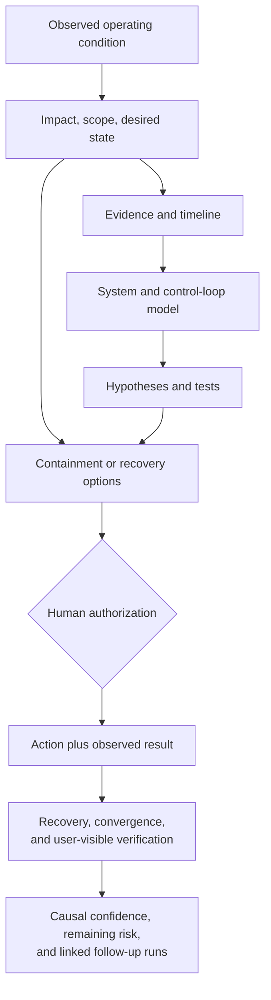

# Operational Stabilization Workflow

Status: pilot v0.1

## Outcome

Use this flow when a live system is outside an acceptable operating state and the immediate outcome is restoration, stabilization, or demonstrated convergence. It covers code and non-code causes such as reconciliation storms, configuration drift, capacity exhaustion, provider behavior, dependency failure, and emergent controller interaction.

Incident mode is an urgency and coordination overlay. It does not assert a cause.

## Lifecycle

Investigation and stabilization may proceed concurrently. Service restoration must not wait for a complete causal explanation when a human authorizes a proportionate intervention.

## Minimal phases

| Phase | Human owns | AI may | Minimum record | Advance when |
|---|---|---|---|---|
| Detect and assess | Incident declaration, impact, scope, severity, and desired operating state | Correlate authorized signals and expose missing information | Timeline start, affected users/systems, actual and desired state | Response mode and ownership are clear |
| Investigate | System/control-loop model, hypothesis selection, test authorization, and conclusions | Organize telemetry, identify changes, generate hypotheses, find contradictions | Facts, timeline, model, hypotheses, tests, and unknowns | Enough is known to guide action or bound uncertainty |
| Stabilize | Containment, mitigation, recovery priorities, and risk | Compare interventions, rollback paths, and likely side effects | Candidate action, purpose, scope, blast radius, rollback | Human authorizes consequential action |
| Execute and observe | Action execution and interpretation | Assist only within separately authorized operational permissions | Actor, command or change, time, result, and new evidence | Result is known and desired state is approached |
| Verify recovery | Recovery criteria and user-visible validation | Analyze convergence and recurrence indicators | Health, convergence, and external behavior evidence | Recovery is demonstrated, not merely assumed |
| Monitor | Duration and signals sufficient to detect recurrence | Summarize authorized telemetry | Monitoring window and result | Human accepts stability or reopens response |
| Outcome and follow-up | Closure, remaining risk, causal confidence, and routed work | Summarize timeline and proposed follow-ups | Outcome, unknowns, deferred records, linked runs | Human accepts closure and follow-up disposition |

## Parallel evidence and action chains

## Incident and emergency overlay

During incident or emergency mode, maintain at minimum:

- current owner and impact;
- timestamped consequential actions and decisions;
- actor, rationale, scope, blast radius, rollback, and result;
- current recovery criteria and communications owner;
- deferred records that must be reconstructed after stabilization.

## Non-waivable pilot rules

- Workflow permission is not production authorization.
- A live intervention requires an accountable human unless existing automation was previously authorized for that action.
- Kubernetes readiness, controller status, or a successful command is not automatically user-visible recovery.
- The conclusion may include mechanism, trigger, enabling conditions, and detection or containment gaps rather than one root cause.
- Closure does not require every follow-up to remain inside the operational run.

## Pilot questions

- What threshold should activate incident mode?
- Which records were feasible during response versus reconstructed later?
- When was unknown-cause remediation justified?
- What evidence demonstrated convergence and user-visible recovery?
- Did linked follow-up runs prevent the incident from remaining permanently open?
