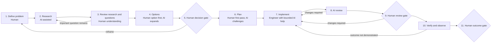

# Product Change Workflow

Status: pilot v0.1

## Outcome

Use this flow when the dominant outcome is new, changed, adapted, migrated, or retired externally meaningful behavior. It ends with verified intended behavior and an accountable human outcome decision.

Do not use it when the main task is explaining an observed failure, restoring a live system, making a decision without implementation, producing knowledge, or improving internals while preserving behavior.

## Lifecycle

## Minimal phases

| Phase | Human owns | AI may | Minimum record | Advance when |
|---|---|---|---|---|
| Define | Desired outcome, users, scope, constraints, initial questions | Clarify ambiguity and expose assumptions | Problem and success signals | Human accepts the framing |
| Research | Reading and evaluating material | Gather internal/external evidence, cite, compare, identify gaps | Evidence links, findings, contradictions | Material evidence is available |
| Questions | Understanding and disposition of unknowns | Find missing questions and research answers | Answered, accepted, blocked, or deferred unknowns | Important unknowns are answered or explicitly accepted |
| Options | At least one initial approach and evaluation criteria | Expand, compare, challenge, add alternatives | Options and tradeoffs | Viable options are understood |
| Decide | Selection and consequences | Check rationale and surface risks | Decision, rationale, tradeoffs, reversibility | Accountable human approves the decision |
| Plan | First-pass implementation plan | Identify gaps, dependencies, tests, risks, and rollback needs | Sequenced plan and deviations policy | Human approves the final plan |
| Implement | Code and engineering changes | Bounded generation, explanation, tests, debugging, and refactoring assistance | Linked changeset and plan deviations | Work is ready for independent review and checks pass |
| AI review | Resolution of valid findings | Review behavior, security, tests, architecture, and plan alignment | Findings and dispositions | Blocking findings are resolved or rejected with rationale |
| Human review | Final engineering judgment | Answer targeted questions and retrieve evidence | Current human review | Human reviewer accepts the current change |
| Verify and observe | Evaluation against intended behavior | Suggest checks and analyze authorized observations | Test, deployment, and user-visible evidence | Intended outcome is demonstrated or failure is recorded |
| Outcome | Acceptance, rollback, follow-up, or abandonment | Summarize learning | Result, uncertainty, follow-ups | Human accepts closure or routes more work |

## Artifact and evidence chain

```mermaid
flowchart LR
    P["Problem and success signals"] --> RES["Research and questions"]
    RES --> OPT["Human option plus alternatives"]
    OPT --> D["Decision and rationale"]
    D --> PL["Human first-pass and final plan"]
    PL --> C["Changeset and tests"]
    C --> REV["AI review and human review"]
    REV --> VER["Verification and observations"]
    VER --> OUT["Outcome and learning"]
```

## Non-waivable pilot rules

- A human defines or affirms the problem and outcome.
- A human contributes an option before AI expands the option set.
- A human authors the first-pass plan.
- AI review does not satisfy human review.
- Implementation completion is not deployment or outcome verification.

## Pilot questions

- Did separate research and question review improve the decision?
- Did requiring a human option and first-pass plan improve understanding or only add ceremony?
- Which changes were material enough to reopen the decision or plan?
- What outcome evidence was available only after deployment?
