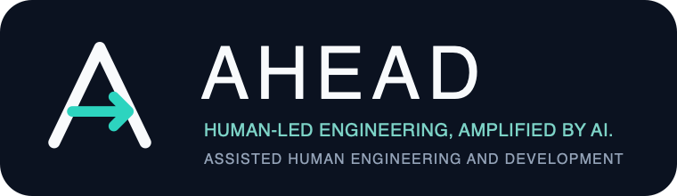

<p align="center">
  
</p>

# AHEAD for VS Code

This extension keeps an AHEAD run visible in VS Code and gives GitHub Copilot the active workflow context without transferring human gates to the model.

## Pilot locally

```sh
cd integrations/vscode
npm install
npm test
npm run package
code --install-extension ahead-vscode-0.1.0.vsix
```

Open a project, select the AHEAD activity-bar view, and choose **Start workflow**. Select the contributed **AHEAD** Copilot agent while the run is active. Pi and VS Code use the same `.ahead` records, so an explicitly saved run can be resumed in either host.

Human commands own workflow selection, records, work-item policy, gate acceptance, transitions, return, stop, and resume. Copilot tools can read context and references, capture a review snapshot, and record only AI/shared artifacts allowed by the active phase.

VS Code does not expose interception of its built-in agent tools to extensions. The AHEAD agent therefore instructs Copilot to obey the engine's active capabilities, while the deterministic engine strictly enforces every recorded artifact, gate, and transition.
